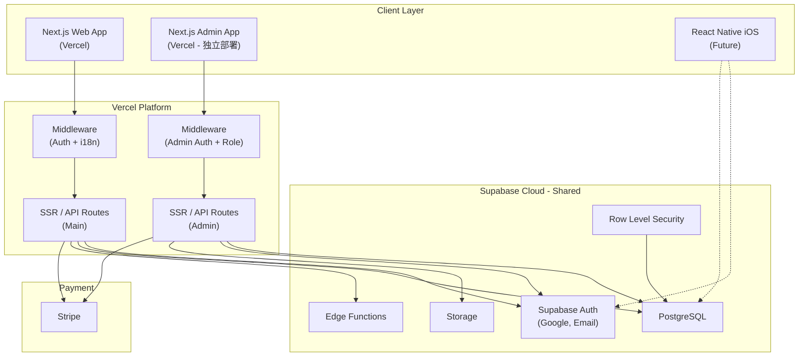
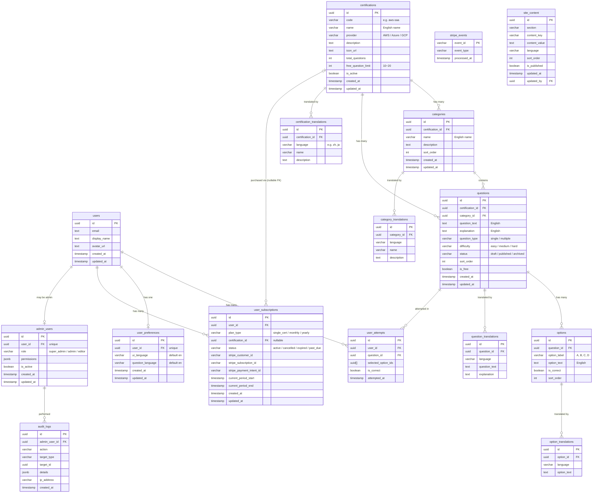

# CloudCert - 云认证题库练习平台

> 本文档为项目设计总纲（Source of Truth），与 `docs/` 下的各功能详细设计文档共同构成完整设计体系。代码或设计变更时须同步更新相关文档。

## 项目概述

CloudCert 是一个多平台云认证考试练习应用，帮助用户通过系统化的题库练习来准备并通过云认证考试（如 AWS、Azure、GCP）。第一阶段聚焦 Web 端和 AWS 认证题库。

## 技术栈

| 层级 | 技术选型 | 版本 | 说明 |
|------|---------|------|------|
| 前端（Web） | Next.js (App Router) + React + TypeScript + Tailwind CSS | Next.js 16.x, React 19.x, TS 5.9.x, Tailwind 4.x | 部署在 Vercel |
| UI 组件 | Shadcn/UI (基于 Radix UI) | — | 主站和管理后台统一组件库 |
| 前端（iOS） | React Native | — | 第二阶段规划 |
| 后端 & 数据库 | Supabase (PostgreSQL + Auth + Edge Functions + Storage) | @supabase/supabase-js 2.99.x | 托管服务 |
| 国际化（UI） | next-intl | 4.8.x | 网站界面多语言 |
| 国际化（内容） | 数据库翻译表 | — | 题目/选项/解析多语言 |
| 动画 | Framer Motion (motion/react) | 12.x | 页面动效与交互动画 |
| 支付 | Stripe | — | 信用卡支付 |
| 错误追踪 | Sentry | — | 前端 + Edge Function 错误监控 |
| 邮件服务 | Resend | — | 业务邮件发送（欢迎邮件、订阅通知等） |

## 系统架构



> 管理后台是独立的 Next.js 应用，与主站共享同一个 Supabase 数据库，通过 `admin_users` 表和角色权限控制访问。详见 [design-admin.md](docs/design-admin.md)。

## 数据库 Schema 概览



### 表字段详细说明

#### `users` — 用户信息

与 Supabase Auth (`auth.users`) 关联，用户通过 Auth 注册后由 Database Trigger 自动创建记录。

| 字段 | 类型 | 约束 | 说明 |
|------|------|------|------|
| `id` | uuid | PK | 主键，与 `auth.users.id` 一致，由 Supabase Auth 生成 |
| `email` | text | NOT NULL, UNIQUE | 用户邮箱地址，来自 Auth 注册信息 |
| `display_name` | text | | 用户显示名称，Google 登录时自动填充，Email 注册时由用户输入 |
| `avatar_url` | text | | 用户头像 URL，Google 登录时自动获取，也可手动上传至 Supabase Storage |
| `created_at` | timestamp | NOT NULL, DEFAULT NOW() | 记录创建时间 |
| `updated_at` | timestamp | NOT NULL, DEFAULT NOW() | 记录最后更新时间，每次修改时由触发器自动更新 |

#### `certifications` — 认证类型

存储各云厂商的认证考试信息，如 AWS SAA、AWS SAP 等。

| 字段 | 类型 | 约束 | 说明 |
|------|------|------|------|
| `id` | uuid | PK | 主键，自动生成 |
| `code` | varchar | NOT NULL, UNIQUE | 认证唯一编码，用于 URL 路由，如 `aws-saa`、`aws-sap`、`az-900` |
| `name` | varchar | NOT NULL | 认证英文名称，如 "AWS Solutions Architect Associate" |
| `provider` | varchar | NOT NULL | 云厂商标识：`AWS`、`Azure`、`GCP` |
| `description` | text | | 认证描述（英文），介绍考试范围和目标人群 |
| `icon_url` | text | | 认证图标 URL，用于列表和卡片展示 |
| `total_questions` | int | NOT NULL, DEFAULT 0 | 该认证题库的总题目数量（冗余字段，方便查询） |
| `free_question_limit` | int | NOT NULL, DEFAULT 10 | 免费用户可访问的题目数量上限（10~20） |
| `is_active` | boolean | NOT NULL, DEFAULT false | 是否已上线，`false` 表示 "Coming Soon" 状态 |
| `created_at` | timestamp | NOT NULL, DEFAULT NOW() | 记录创建时间 |
| `updated_at` | timestamp | NOT NULL, DEFAULT NOW() | 记录最后更新时间 |

#### `certification_translations` — 认证翻译

存储认证信息的多语言翻译版本。

| 字段 | 类型 | 约束 | 说明 |
|------|------|------|------|
| `id` | uuid | PK | 主键，自动生成 |
| `certification_id` | uuid | FK → certifications.id, NOT NULL | 关联的认证 ID |
| `language` | varchar | NOT NULL | 语言代码，如 `zh`（中文）、`ja`（日文）、`ko`（韩文） |
| `name` | varchar | NOT NULL | 该语言下的认证名称 |
| `description` | text | | 该语言下的认证描述 |

> 唯一约束：`(certification_id, language)` 确保每个认证每种语言只有一条翻译记录。

#### `categories` — 知识领域分类

每个认证下的知识领域划分，如 AWS SAA 下的 "Compute"、"Storage"、"Networking" 等。

| 字段 | 类型 | 约束 | 说明 |
|------|------|------|------|
| `id` | uuid | PK | 主键，自动生成 |
| `certification_id` | uuid | FK → certifications.id, NOT NULL | 所属认证 ID |
| `name` | varchar | NOT NULL | 分类英文名称，如 "Compute"、"Storage" |
| `description` | text | | 分类描述（英文），说明该知识领域的范围 |
| `sort_order` | int | NOT NULL, DEFAULT 0 | 排序权重，数值越小越靠前，用于分类列表的显示顺序 |
| `created_at` | timestamp | NOT NULL, DEFAULT NOW() | 记录创建时间 |
| `updated_at` | timestamp | NOT NULL, DEFAULT NOW() | 记录最后更新时间 |

#### `category_translations` — 分类翻译

存储知识领域分类的多语言翻译版本。

| 字段 | 类型 | 约束 | 说明 |
|------|------|------|------|
| `id` | uuid | PK | 主键，自动生成 |
| `category_id` | uuid | FK → categories.id, NOT NULL | 关联的分类 ID |
| `language` | varchar | NOT NULL | 语言代码 |
| `name` | varchar | NOT NULL | 该语言下的分类名称 |
| `description` | text | | 该语言下的分类描述 |

> 唯一约束：`(category_id, language)`

#### `questions` — 题目主表

存储题目内容，英文为基础语言。每道题属于一个认证和一个分类。

| 字段 | 类型 | 约束 | 说明 |
|------|------|------|------|
| `id` | uuid | PK | 主键，自动生成 |
| `certification_id` | uuid | FK → certifications.id, NOT NULL | 所属认证 ID |
| `category_id` | uuid | FK → categories.id, NOT NULL | 所属知识领域分类 ID |
| `question_text` | text | NOT NULL | 题目文本（英文），支持 Markdown 格式 |
| `explanation` | text | | 答案解析（英文），详细说明正确答案的原因及其他选项为何错误，Markdown 格式 |
| `question_type` | varchar | NOT NULL | 题目类型：`single_choice`（单选）或 `multiple_choice`（多选） |
| `difficulty` | varchar | NOT NULL, DEFAULT 'medium' | 难度等级：`easy`（简单）、`medium`（中等）、`hard`（困难） |
| `status` | varchar | NOT NULL, DEFAULT 'published' | 题目状态：`draft`（草稿）、`published`（已发布）、`archived`（已归档），仅 `published` 状态的题目对前端用户可见 |
| `sort_order` | int | NOT NULL | 题目排序号，决定顺序答题时的题目顺序，在同一认证内唯一递增 |
| `is_free` | boolean | NOT NULL, DEFAULT false | 是否为免费题目，`true` 表示未付费用户也可访问 |
| `created_at` | timestamp | NOT NULL, DEFAULT NOW() | 记录创建时间 |
| `updated_at` | timestamp | NOT NULL, DEFAULT NOW() | 记录最后更新时间 |

#### `question_translations` — 题目翻译

存储题目文本和解析的多语言翻译版本。

| 字段 | 类型 | 约束 | 说明 |
|------|------|------|------|
| `id` | uuid | PK | 主键，自动生成 |
| `question_id` | uuid | FK → questions.id, NOT NULL | 关联的题目 ID |
| `language` | varchar | NOT NULL | 语言代码 |
| `question_text` | text | NOT NULL | 该语言下的题目文本 |
| `explanation` | text | | 该语言下的答案解析 |

> 唯一约束：`(question_id, language)`

#### `options` — 题目选项

每道题的可选答案，一道题通常有 4 个选项（A/B/C/D）。

| 字段 | 类型 | 约束 | 说明 |
|------|------|------|------|
| `id` | uuid | PK | 主键，自动生成 |
| `question_id` | uuid | FK → questions.id, NOT NULL | 所属题目 ID |
| `option_label` | varchar | NOT NULL | 选项标签：`A`、`B`、`C`、`D` 等 |
| `option_text` | text | NOT NULL | 选项内容（英文） |
| `is_correct` | boolean | NOT NULL, DEFAULT false | 是否为正确答案，单选题只有一个 `true`，多选题可有多个 `true` |
| `sort_order` | int | NOT NULL | 选项显示顺序，通常与 `option_label` 的字母顺序一致 |

#### `option_translations` — 选项翻译

存储选项内容的多语言翻译版本。

| 字段 | 类型 | 约束 | 说明 |
|------|------|------|------|
| `id` | uuid | PK | 主键，自动生成 |
| `option_id` | uuid | FK → options.id, NOT NULL | 关联的选项 ID |
| `language` | varchar | NOT NULL | 语言代码 |
| `option_text` | text | NOT NULL | 该语言下的选项内容 |

> 唯一约束：`(option_id, language)`

#### `user_attempts` — 用户答题记录

记录用户每次答题的详细信息。错题本功能通过筛选该表中 `is_correct = false` 的最新记录实现。一道题可以被多次作答，每次都会产生一条新记录。

| 字段 | 类型 | 约束 | 说明 |
|------|------|------|------|
| `id` | uuid | PK | 主键，自动生成 |
| `user_id` | uuid | FK → users.id, NOT NULL | 作答用户 ID |
| `question_id` | uuid | FK → questions.id, NOT NULL | 作答题目 ID |
| `selected_option_ids` | uuid[] | NOT NULL | 用户选择的选项 ID 数组，单选题为 1 个元素，多选题为多个元素 |
| `is_correct` | boolean | NOT NULL | 本次作答是否正确，由后端根据选项的 `is_correct` 字段比对计算 |
| `attempted_at` | timestamp | NOT NULL, DEFAULT NOW() | 作答时间，用于排序和确定最新一次答题记录 |

> 索引建议：`(user_id, question_id, attempted_at DESC)` 用于快速查询用户某题的最新作答记录。

#### `user_preferences` — 用户偏好设置

每个用户一条记录，存储个性化设置。

| 字段 | 类型 | 约束 | 说明 |
|------|------|------|------|
| `id` | uuid | PK | 主键，自动生成 |
| `user_id` | uuid | FK → users.id, UNIQUE, NOT NULL | 关联用户 ID，唯一约束确保每用户只有一条记录 |
| `ui_language` | varchar | NOT NULL, DEFAULT 'en' | 网站界面语言，如 `en`（英文）、`zh`（中文），控制菜单/按钮/提示等 UI 元素的语言 |
| `question_language` | varchar | NOT NULL, DEFAULT 'en' | 答题时的默认题目显示语言，用户可在答题界面临时切换 |
| `created_at` | timestamp | NOT NULL, DEFAULT NOW() | 记录创建时间 |
| `updated_at` | timestamp | NOT NULL, DEFAULT NOW() | 记录最后更新时间 |

#### `user_subscriptions` — 用户订阅/购买记录

记录用户的付费状态，支持订阅制和单次购买。

| 字段 | 类型 | 约束 | 说明 |
|------|------|------|------|
| `id` | uuid | PK | 主键，自动生成 |
| `user_id` | uuid | FK → users.id, NOT NULL | 用户 ID |
| `plan_type` | varchar | NOT NULL | 方案类型：`single_cert`（单次购买某认证）、`monthly`（月订阅）、`yearly`（年订阅） |
| `certification_id` | uuid | FK → certifications.id, NULLABLE | 单次购买时关联的认证 ID，订阅制为 NULL（代表全部认证） |
| `status` | varchar | NOT NULL | 订阅状态：`active`（有效）、`cancelled`（已取消）、`expired`（已过期）、`past_due`（逾期） |
| `stripe_customer_id` | varchar | | Stripe 客户 ID |
| `stripe_subscription_id` | varchar | | Stripe 订阅 ID（订阅制使用） |
| `stripe_payment_intent_id` | varchar | | Stripe 支付意图 ID（单次购买使用） |
| `current_period_start` | timestamp | | 当前计费周期开始时间 |
| `current_period_end` | timestamp | | 当前计费周期结束时间，单次购买为 NULL（永久有效） |
| `created_at` | timestamp | NOT NULL, DEFAULT NOW() | 创建时间 |
| `updated_at` | timestamp | NOT NULL, DEFAULT NOW() | 更新时间 |

> 索引建议：`(user_id, status)` 用于快速查询用户有效订阅。

#### `admin_users` — 管理员

标识哪些用户拥有管理后台访问权限及其角色。

| 字段 | 类型 | 约束 | 说明 |
|------|------|------|------|
| `id` | uuid | PK | 主键，自动生成 |
| `user_id` | uuid | FK → users.id, UNIQUE, NOT NULL | 关联用户 ID，唯一约束确保一人一角色 |
| `role` | varchar | NOT NULL, DEFAULT 'editor' | 管理员角色：`super_admin`（超级管理员，全部权限）、`admin`（管理员）、`editor`（编辑者，仅内容编辑） |
| `permissions` | jsonb | DEFAULT '{}' | 细粒度权限配置，如 `{"questions": "write", "users": "read"}` |
| `is_active` | boolean | NOT NULL, DEFAULT true | 是否启用，`false` 表示被禁用 |
| `created_at` | timestamp | NOT NULL, DEFAULT NOW() | 创建时间 |
| `updated_at` | timestamp | NOT NULL, DEFAULT NOW() | 更新时间 |

#### `audit_logs` — 操作审计日志

记录管理后台所有操作行为，用于安全审计和问题追溯。

| 字段 | 类型 | 约束 | 说明 |
|------|------|------|------|
| `id` | uuid | PK | 主键，自动生成 |
| `admin_user_id` | uuid | FK → admin_users.id, NOT NULL | 执行操作的管理员 ID |
| `action` | varchar | NOT NULL | 操作类型：`create`、`update`、`delete`、`ban_user`、`refund`、`publish`、`import` 等 |
| `target_type` | varchar | NOT NULL | 操作对象类型：`question`、`certification`、`category`、`user`、`subscription`、`site_content` 等 |
| `target_id` | uuid | | 操作对象 ID |
| `details` | jsonb | | 操作详情，包含变更前后数据的 diff |
| `ip_address` | varchar | | 操作者 IP 地址 |
| `created_at` | timestamp | NOT NULL, DEFAULT NOW() | 操作时间 |

#### `site_content` — 网站动态内容

存储 Landing Page 等页面的可编辑内容，通过管理后台管理。

| 字段 | 类型 | 约束 | 说明 |
|------|------|------|------|
| `id` | uuid | PK | 主键，自动生成 |
| `section` | varchar | NOT NULL | 内容区块：`hero`、`features`、`pricing`、`testimonials`、`faq` |
| `content_key` | varchar | NOT NULL | 内容键名，如 `hero_title`、`faq_1_question`、`testimonial_1_text` |
| `content_value` | text | NOT NULL | 内容值，支持 Markdown 格式 |
| `language` | varchar | NOT NULL, DEFAULT 'en' | 语言代码 |
| `sort_order` | int | DEFAULT 0 | 排序权重（同一 section 内） |
| `is_published` | boolean | DEFAULT true | 是否发布，`false` 为草稿状态 |
| `updated_at` | timestamp | NOT NULL, DEFAULT NOW() | 最后更新时间 |
| `updated_by` | uuid | FK → admin_users.id | 最后编辑的管理员 ID |

> 唯一约束：`(section, content_key, language)` 确保每个内容块每种语言只有一条记录。

#### `stripe_events` — Stripe Webhook 幂等性

用于防止 Stripe Webhook 重试导致重复处理，详见 [design-profit-model.md](docs/design-profit-model.md)。

| 字段 | 类型 | 约束 | 说明 |
|------|------|------|------|
| `event_id` | varchar | PK | Stripe Event ID，如 `evt_xxx` |
| `event_type` | varchar | NOT NULL | 事件类型，如 `checkout.session.completed` |
| `processed_at` | timestamp | NOT NULL, DEFAULT NOW() | 处理时间 |

### 翻译状态扩展

所有翻译表（`certification_translations`、`category_translations`、`question_translations`、`option_translations`）增加 `status` 字段用于管理后台翻译工作流：

| 字段 | 类型 | 约束 | 说明 |
|------|------|------|------|
| `status` | varchar | NOT NULL, DEFAULT 'draft' | 翻译状态：`draft`（草稿）、`reviewed`（已审核）、`published`（已发布） |

### 索引设计

| 表 | 索引列 | 说明 |
|----|--------|------|
| `questions` | `(certification_id, sort_order)` | 练习模式顺序查询 |
| `questions` | `(certification_id, is_free)` | 免费题目筛选 |
| `questions` | `(certification_id, status)` | 按状态筛选已发布题目 |
| `options` | `(question_id, sort_order)` | 选项排序查询 |
| `user_attempts` | `(user_id, question_id, attempted_at DESC)` | 查询用户某题最新作答记录 |
| `user_subscriptions` | `(user_id, status)` | 查询用户有效订阅 |
| `user_subscriptions` | `(stripe_subscription_id)` | Stripe Webhook 处理查询 |
| `user_subscriptions` | `(stripe_customer_id)` | Stripe 客户查询 |
| `certification_translations` | `(certification_id, language)` | 翻译查询（唯一约束自带） |
| `category_translations` | `(category_id, language)` | 翻译查询（唯一约束自带） |
| `question_translations` | `(question_id, language)` | 翻译查询（唯一约束自带） |
| `option_translations` | `(option_id, language)` | 翻译查询（唯一约束自带） |

### `total_questions` 同步触发器

`certifications.total_questions` 为冗余字段，通过触发器自动保持同步：

```sql
CREATE OR REPLACE FUNCTION update_cert_question_count()
RETURNS trigger AS $$
BEGIN
  IF TG_OP = 'DELETE' THEN
    UPDATE certifications
    SET total_questions = (
      SELECT COUNT(*) FROM questions
      WHERE certification_id = OLD.certification_id AND status = 'published'
    )
    WHERE id = OLD.certification_id;
    RETURN OLD;
  ELSE
    UPDATE certifications
    SET total_questions = (
      SELECT COUNT(*) FROM questions
      WHERE certification_id = NEW.certification_id AND status = 'published'
    )
    WHERE id = NEW.certification_id;
    RETURN NEW;
  END IF;
END;
$$ LANGUAGE plpgsql;

CREATE TRIGGER trg_question_count_sync
  AFTER INSERT OR UPDATE OF status OR DELETE ON questions
  FOR EACH ROW EXECUTE FUNCTION update_cert_question_count();
```

### Row Level Security (RLS) 策略汇总

> 管理后台使用 Supabase Service Role Key 绕过 RLS，以下策略仅约束前端用户访问。

```sql
-- === users ===
ALTER TABLE users ENABLE ROW LEVEL SECURITY;
CREATE POLICY "Users can view own profile"
  ON users FOR SELECT USING (auth.uid() = id);
CREATE POLICY "Users can update own profile"
  ON users FOR UPDATE USING (auth.uid() = id);

-- === user_preferences ===
ALTER TABLE user_preferences ENABLE ROW LEVEL SECURITY;
CREATE POLICY "Users can manage own preferences"
  ON user_preferences FOR ALL USING (auth.uid() = user_id);

-- === user_attempts ===
ALTER TABLE user_attempts ENABLE ROW LEVEL SECURITY;
CREATE POLICY "Users can view own attempts"
  ON user_attempts FOR SELECT USING (auth.uid() = user_id);
CREATE POLICY "Users can insert own attempts"
  ON user_attempts FOR INSERT WITH CHECK (auth.uid() = user_id);

-- === user_subscriptions ===
ALTER TABLE user_subscriptions ENABLE ROW LEVEL SECURITY;
CREATE POLICY "Users can view own subscriptions"
  ON user_subscriptions FOR SELECT USING (auth.uid() = user_id);

-- === certifications（公开数据，仅展示已上线的） ===
ALTER TABLE certifications ENABLE ROW LEVEL SECURITY;
CREATE POLICY "Anyone can view active certifications"
  ON certifications FOR SELECT USING (is_active = true);

-- === categories（公开数据） ===
ALTER TABLE categories ENABLE ROW LEVEL SECURITY;
CREATE POLICY "Anyone can view categories"
  ON categories FOR SELECT USING (true);

-- === questions（核心安全策略） ===
ALTER TABLE questions ENABLE ROW LEVEL SECURITY;
CREATE POLICY "Users can access free or purchased questions"
  ON questions FOR SELECT
  USING (
    status = 'published' AND (
      is_free = true
      OR EXISTS (
        SELECT 1 FROM user_subscriptions
        WHERE user_id = auth.uid()
        AND (
          certification_id = questions.certification_id
          OR plan_type IN ('monthly', 'yearly')
        )
        AND status = 'active'
      )
    )
  );

-- === options（跟随 questions 的访问控制） ===
ALTER TABLE options ENABLE ROW LEVEL SECURITY;
CREATE POLICY "Users can view options for accessible questions"
  ON options FOR SELECT
  USING (
    EXISTS (
      SELECT 1 FROM questions
      WHERE questions.id = options.question_id
    )
  );

-- === 翻译表（公开数据） ===
ALTER TABLE certification_translations ENABLE ROW LEVEL SECURITY;
CREATE POLICY "Anyone can view" ON certification_translations FOR SELECT USING (true);
ALTER TABLE category_translations ENABLE ROW LEVEL SECURITY;
CREATE POLICY "Anyone can view" ON category_translations FOR SELECT USING (true);
ALTER TABLE question_translations ENABLE ROW LEVEL SECURITY;
CREATE POLICY "Anyone can view" ON question_translations FOR SELECT USING (true);
ALTER TABLE option_translations ENABLE ROW LEVEL SECURITY;
CREATE POLICY "Anyone can view" ON option_translations FOR SELECT USING (true);
```

> **安全注意**：`options.is_correct` 字段**不得在用户提交答案前返回到客户端**。答题时查询 `options` 应排除 `is_correct` 列，提交答案后由服务端 API 判定正误。详见 [design-practice.md](docs/design-practice.md) 安全性设计章节。

## 页面结构总览

### 主站（Main App）

| 路由 | 页面 | 是否需要登录 | 详细设计 |
|------|------|-------------|---------|
| `/` | Landing Page（Hero、Features、FAQ、CTA） | 否 | [design-landing-page.md](docs/design-landing-page.md) |
| `/auth/login` | 登录页 | 否 | [design-auth.md](docs/design-auth.md) |
| `/auth/register` | 注册页 | 否 | [design-auth.md](docs/design-auth.md) |
| `/dashboard` | 用户仪表盘 | 是 | [design-dashboard.md](docs/design-dashboard.md) |
| `/certifications` | 认证列表 | 否（查看）/ 是（练习） | [design-practice.md](docs/design-practice.md) |
| `/practice/[certId]` | 练习页面 | 是 | [design-practice.md](docs/design-practice.md) |
| `/wrong-answers` | 错题本 | 是 | [design-wrong-answers.md](docs/design-wrong-answers.md) |
| `/search` | 搜索页面 | 否 | [design-search.md](docs/design-search.md) |
| `/roadmap` | 产品路线图 | 否 | [design-roadmap.md](docs/design-roadmap.md) |
| `/settings` | 用户设置 | 是 | [design-auth.md](docs/design-auth.md) |

### 管理后台（Admin App - 独立部署）

| 路由 | 页面 | 权限 |
|------|------|------|
| `/admin` | 管理仪表盘 | 所有管理员 |
| `/admin/questions` | 题库管理 | Editor+ |
| `/admin/certifications` | 认证管理 | Admin+ |
| `/admin/users` | 用户管理 | Admin+（只读）/ Super Admin（封禁） |
| `/admin/translations` | 翻译管理 | Editor+ |
| `/admin/statistics` | 数据统计 | Editor+（只读）/ Admin+ |
| `/admin/orders` | 订单管理 | Admin+（只读）/ Super Admin（退款） |
| `/admin/content` | 内容管理 | Editor+ |
| `/admin/settings/admins` | 管理员管理 | Super Admin |

> 详见 [design-admin.md](docs/design-admin.md)

## 功能详细设计文档索引

| 文档 | 功能模块 | 说明 |
|------|---------|------|
| [design-landing-page.md](docs/design-landing-page.md) | Landing Page | Hero、Features、FAQ、CTA、Testimonials |
| [design-auth.md](docs/design-auth.md) | 认证与用户系统 | Google OAuth、Email 注册登录、用户设置 |
| [design-practice.md](docs/design-practice.md) | 练习模式 | 顺序答题、分类练习、实时反馈 |
| [design-explanation.md](docs/design-explanation.md) | 题目详解 | 答案解析、多语言解析 |
| [design-wrong-answers.md](docs/design-wrong-answers.md) | 错题本 | 错题筛选、重做、统计 |
| [design-search.md](docs/design-search.md) | 搜索功能 | 题目搜索、认证搜索 |
| [design-i18n.md](docs/design-i18n.md) | 多语言策略 | UI 国际化、内容多语言 |
| [design-dashboard.md](docs/design-dashboard.md) | 用户仪表盘 | 练习进度、正确率统计 |
| [design-profit-model.md](docs/design-profit-model.md) | 盈利模式 | Freemium、订阅、单次购买 |
| [design-admin.md](docs/design-admin.md) | 管理后台系统 | 题库/认证/用户/翻译/统计/订单/内容管理 |
| [design-ux-standards.md](docs/design-ux-standards.md) | UX 设计标准 | Design Tokens、组件规范、交互模式、a11y 无障碍、响应式规范 |
| [design-seo.md](docs/design-seo.md) | SEO 策略 | Meta 标签、结构化数据、Sitemap、Core Web Vitals、多语言 SEO |
| [design-roadmap.md](docs/design-roadmap.md) | 产品路线图 | 各阶段计划 |

## 部署架构

- **主站 Web 应用**: Vercel（Next.js 自动部署，Git 集成 CI/CD），域名如 `cloudcert.com`
- **管理后台**: Vercel（独立 Next.js 项目），域名如 `admin.cloudcert.com`
- **数据库 & 后端**: Supabase Cloud（PostgreSQL、Auth、Edge Functions、Storage），两个应用共享
- **支付**: Stripe（Webhook 通知 → Supabase Edge Function 处理）
- **域名 & CDN**: Vercel 内置 CDN + 自定义域名

## 测试策略

| 层级 | 工具 | 覆盖范围 |
|------|------|---------|
| 单元测试 | Vitest | 工具函数、数据转换、业务逻辑 |
| 组件测试 | React Testing Library + Vitest | UI 组件渲染和交互 |
| API 测试 | Vitest + MSW (Mock Service Worker) | API Route / Server Action |
| E2E 测试 | Playwright | 关键用户流程（注册、登录、答题、支付） |
| 视觉回归 | Playwright Screenshots | 关键页面截图对比 |

## CI/CD 与环境策略

| 环境 | 用途 | 数据库 | 部署方式 |
|------|------|--------|---------|
| Development | 本地开发 | Supabase Local (Docker) | `next dev` |
| Preview | PR 预览，代码审查 | Supabase Staging 项目 | Vercel Preview Deployments |
| Production | 线上正式环境 | Supabase Production 项目 | Vercel Production（`main` 分支自动部署） |

- **数据库迁移**：使用 Supabase CLI (`supabase migration`) 管理 Schema 变更
- **环境变量**：Vercel Environment Variables 分环境管理，敏感变量使用 Vercel Encrypted Secrets

## 监控与运维

| 工具 | 用途 |
|------|------|
| Sentry | 前端 + Edge Function 错误追踪和告警 |
| Vercel Analytics | 实时性能监控（Core Web Vitals） |
| Vercel Speed Insights | 真实用户性能数据 |
| Google Search Console | SEO 索引状态和搜索表现 |
| Google Analytics 4 | 用户行为分析和转化追踪 |
| Supabase Dashboard | 数据库性能、API 请求量、Auth 统计 |
| UptimeRobot / Better Stack | 网站可用性监控和宕机告警 |
