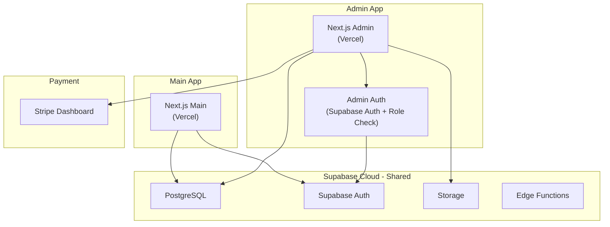
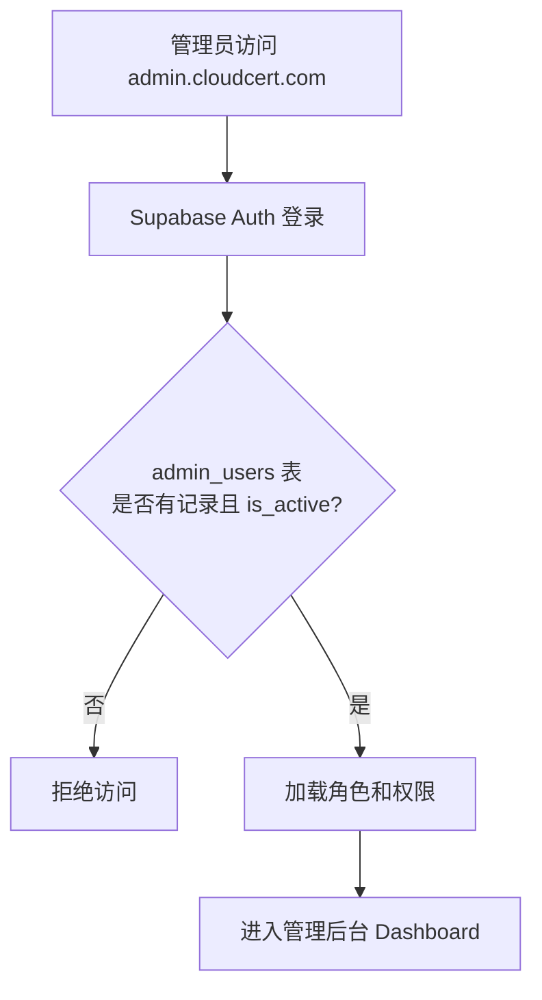

# 管理后台系统详细设计

> 关联总纲：[Cursor.md](../Cursor.md) | 独立应用，单独部署

## 概述

管理后台是一个独立的 Next.js 应用，用于运营团队管理 CloudCert 平台的所有内容和数据。与主站共享同一个 Supabase 数据库，通过管理员角色权限控制访问。

## 技术栈

| 层级 | 技术选型 | 说明 |
|------|---------|------|
| 框架 | Next.js 16 (App Router) + TypeScript | 与主站保持一致 |
| UI 组件 | Tailwind CSS 4 + Shadcn/UI | 快速构建后台界面 |
| 表格 | TanStack Table | 数据表格排序、筛选、分页 |
| 表单 | React Hook Form + Zod | 表单验证 |
| 图表 | Recharts | 数据统计可视化 |
| 数据库 | Supabase (共享主站数据库) | 通过 Service Role Key 访问 |
| 部署 | Vercel（独立项目） | 独立域名如 `admin.cloudcert.com` |

## 系统架构



## 管理员认证

### `admin_users` 表

> 表结构详见 [Cursor.md](../Cursor.md) 的"表字段详细说明"章节。

### 角色权限矩阵

| 功能模块 | Super Admin | Admin | Editor |
|---------|-------------|-------|--------|
| 题库管理（CRUD） | ✅ | ✅ | ✅ |
| 批量导入导出 | ✅ | ✅ | ❌ |
| 认证管理（CRUD） | ✅ | ✅ | ❌ |
| 认证上下线控制 | ✅ | ✅ | ❌ |
| 用户管理 | ✅ | ✅ (只读) | ❌ |
| 用户封禁 | ✅ | ❌ | ❌ |
| 翻译管理 | ✅ | ✅ | ✅ |
| 数据统计 | ✅ | ✅ | ✅ (只读) |
| 订单/支付管理 | ✅ | ✅ (只读) | ❌ |
| 内容管理 | ✅ | ✅ | ✅ |
| 管理员管理 | ✅ | ❌ | ❌ |

### 认证流程



## 功能模块

### 页面结构

```
/admin
├── /                        # Dashboard（数据概览）
├── /questions               # 题库管理
│   ├── /                    # 题目列表
│   ├── /create              # 新建题目
│   ├── /[id]/edit           # 编辑题目
│   └── /import              # 批量导入
├── /certifications          # 认证管理
│   ├── /                    # 认证列表
│   ├── /create              # 新建认证
│   └── /[id]/edit           # 编辑认证（含分类管理）
├── /users                   # 用户管理
│   ├── /                    # 用户列表
│   └── /[id]                # 用户详情
├── /translations            # 翻译管理
│   ├── /                    # 翻译概览
│   └── /[type]/[id]         # 翻译编辑（type: question/cert/category）
├── /statistics              # 数据统计
│   ├── /                    # 概览仪表盘
│   ├── /users               # 用户分析
│   └── /revenue             # 收入报表
├── /orders                  # 订单管理
│   ├── /                    # 订单列表
│   └── /[id]                # 订单详情
├── /content                 # 内容管理
│   ├── /landing             # Landing Page 内容
│   ├── /faq                 # FAQ 管理
│   └── /testimonials        # 评价管理
└── /settings                # 系统设置
    └── /admins              # 管理员管理
```

---

### 模块 1：题库管理

#### 题目列表页

| 功能 | 说明 |
|------|------|
| 数据表格 | 显示题目 ID、题目预览、认证、分类、类型、难度、是否免费、翻译状态 |
| 筛选 | 按认证、分类、难度、类型、免费/付费、翻译状态筛选 |
| 搜索 | 按题目内容关键词搜索 |
| 排序 | 按 sort_order、创建时间、难度排序 |
| 批量操作 | 批量删除、批量修改难度、批量设为免费/付费 |

#### 题目编辑页

```
┌─────────────────────────────────────────────────┐
│  ← Back to Questions     Edit Question          │
│─────────────────────────────────────────────────│
│                                                 │
│  Certification: [AWS SAA ▼]                     │
│  Category:      [Compute ▼]                     │
│  Type:          ○ Single Choice ● Multi Choice  │
│  Difficulty:    [Medium ▼]                      │
│  Sort Order:    [12]                            │
│  Free:          [✅]                            │
│                                                 │
│  Question Text (English):                       │
│  ┌─────────────────────────────────────────┐    │
│  │ Which AWS service provides resizable... │    │
│  └─────────────────────────────────────────┘    │
│                                                 │
│  Options:                                       │
│  ┌───┬─────────────────────────────┬──────┐    │
│  │ A │ Amazon S3                    │ ☐    │    │
│  │ B │ Amazon EC2                   │ ☑    │    │
│  │ C │ Amazon RDS                   │ ☐    │    │
│  │ D │ AWS Lambda                   │ ☐    │    │
│  └───┴─────────────────────────────┴──────┘    │
│  [+ Add Option]                                 │
│                                                 │
│  Explanation (English):                         │
│  ┌─────────────────────────────────────────┐    │
│  │ Amazon EC2 provides resizable compute.. │    │
│  │ (Markdown editor)                       │    │
│  └─────────────────────────────────────────┘    │
│                                                 │
│  [Preview] [Save Draft] [Publish]               │
└─────────────────────────────────────────────────┘
```

#### 批量导入

- 支持 CSV / JSON 格式导入
- CSV 模板下载功能
- 导入前预览和校验（重复检测、格式检查）
- 导入进度条和结果报告

CSV 模板格式：
```
certification_code,category_name,question_text,question_type,difficulty,option_a,option_b,option_c,option_d,correct_options,explanation,is_free
aws-saa,Compute,"Which service...",single_choice,medium,"Amazon S3","Amazon EC2","Amazon RDS","AWS Lambda",B,"Amazon EC2 provides...",true
```

---

### 模块 2：认证管理

| 功能 | 说明 |
|------|------|
| 认证列表 | 显示认证名称、厂商、题目数、免费题数、状态（Active/Coming Soon） |
| 新建/编辑认证 | 编辑认证信息（名称、编码、厂商、描述、图标、免费题数限制） |
| 分类管理 | 在认证编辑页内管理该认证的知识领域分类（CRUD + 拖拽排序） |
| 上下线控制 | 切换 `is_active` 状态，控制前台显示 |

---

### 模块 3：用户管理

| 功能 | 说明 |
|------|------|
| 用户列表 | 显示用户名、邮箱、注册时间、登录方式、订阅状态、答题数 |
| 搜索/筛选 | 按邮箱、用户名搜索；按注册时间、订阅状态筛选 |
| 用户详情 | 查看用户信息、练习记录、订阅历史 |
| 封禁/解禁 | Super Admin 可封禁违规用户（禁止登录） |

---

### 模块 4：翻译管理

| 功能 | 说明 |
|------|------|
| 翻译概览 | 各语言的翻译完成率统计（题目、选项、认证、分类） |
| 翻译编辑 | 左右对照编辑：左侧英文原文，右侧翻译文本 |
| 批量翻译 | 导出未翻译内容为 CSV，翻译完成后导入 |
| 翻译状态 | 标记翻译为 "Draft" / "Reviewed" / "Published"（通过翻译表的 `status` 字段跟踪） |

翻译编辑界面：

```
┌─────────────────────────────────────────────────┐
│  Translation: Question #12 → 中文 (zh)          │
│─────────────────────────────────────────────────│
│                                                 │
│  ┌──────────────────┐ ┌──────────────────┐      │
│  │ English (Source)  │ │ 中文 (Target)    │      │
│  │                  │ │                  │      │
│  │ Question:        │ │ 题目:            │      │
│  │ Which AWS service│ │ 哪个 AWS 服务提供│      │
│  │ provides...      │ │ 可调整的...      │      │
│  │                  │ │                  │      │
│  │ Explanation:     │ │ 解析:            │      │
│  │ Amazon EC2...    │ │ Amazon EC2...    │      │
│  │                  │ │                  │      │
│  │ Option A:        │ │ 选项 A:          │      │
│  │ Amazon S3        │ │ Amazon S3        │      │
│  │ ...              │ │ ...              │      │
│  └──────────────────┘ └──────────────────┘      │
│                                                 │
│  Status: [Draft ▼]                              │
│  [Save] [Next Untranslated →]                   │
└─────────────────────────────────────────────────┘
```

---

### 模块 5：数据统计

#### 概览仪表盘

- **核心指标卡片**：总用户数、日活跃用户（DAU）、月活跃用户（MAU）、总答题次数
- **趋势图**：过去 30 天的新注册用户、活跃用户、答题量趋势
- **认证排行**：最受欢迎的认证题库（按活跃用户数排序）

#### 用户分析

- 注册渠道分布（Google vs Email）
- 用户留存率（1日/7日/30日）
- 免费转付费转化率
- 各认证的用户参与度

#### 收入报表

- 月度收入趋势（MRR - Monthly Recurring Revenue）
- 收入构成（订阅 vs 单次购买）
- 订阅方案分布（月度 vs 年度）
- 退款率

---

### 模块 6：订单/支付管理

| 功能 | 说明 |
|------|------|
| 订单列表 | 显示订单号、用户、金额、方案类型、状态、时间 |
| 订单详情 | 查看完整支付信息、Stripe Payment Intent 详情 |
| 退款处理 | 通过 Stripe API 发起退款（Super Admin） |
| 订阅管理 | 查看活跃订阅、取消订阅记录 |

数据通过 Stripe API 实时查询 + `user_subscriptions` 表本地记录结合展示。

---

### 模块 7：内容管理

#### Landing Page 内容

可编辑的 Landing Page 动态内容：

| 内容块 | 字段 |
|--------|------|
| Hero Section | 标题、副标题、CTA 按钮文案 |
| Features | 各功能卡片的图标、标题、描述 |
| Pricing | 各方案名称、价格、功能列表 |
| Testimonials | 用户评价（头像、姓名、认证、评价内容） |
| FAQ | 问题、回答（支持 Markdown） |

#### 存储方式

使用 `site_content` 表，表结构详见 [Cursor.md](../Cursor.md) 的"表字段详细说明"章节。

> 唯一约束：`(section, content_key, language)`

---

## 安全考虑

- Admin App 使用 Supabase Service Role Key 绕过 RLS，需通过应用层鉴权
- 所有管理 API 路由通过 Middleware 验证管理员身份和权限
- 敏感操作（删除、封禁、退款）需二次确认
- 操作审计日志记录所有管理行为（who、what、when）
- Admin 域名设置 IP 白名单或 VPN 访问限制（可选）

### `audit_logs` 表

> 表结构详见 [Cursor.md](../Cursor.md) 的"表字段详细说明"章节。

## 技术实现要点

- Admin App 使用 Supabase `createClient` with Service Role Key 进行数据库操作
- 表格使用 TanStack Table 实现服务端分页、排序、筛选
- 表单使用 React Hook Form + Zod schema 验证
- 题目编辑器中的 Explanation 字段使用 Markdown 编辑器（如 MDXEditor）
- 批量导入使用 Web Worker 解析大文件，避免阻塞 UI
- 图表使用 Recharts 实现，数据通过 Server Component 预加载
