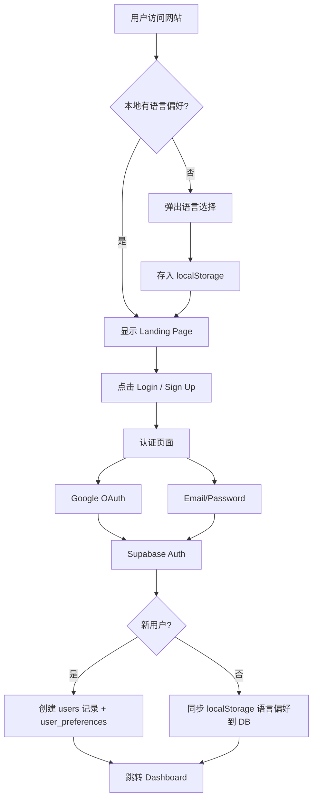

# 认证与用户系统详细设计

> 关联总纲：[Cursor.md](../Cursor.md) | 路由：`/auth/login`、`/auth/register`、`/settings`

## 概述

用户认证系统基于 Supabase Auth 实现，第一阶段支持 Google OAuth 和 Email/Password 注册登录。用户首次进入时选择偏好语言，登录后将偏好同步至数据库。

## 认证方式

### 第一阶段


| 方式             | 实现                              | 说明             |
| -------------- | ------------------------------- | -------------- |
| Google OAuth   | Supabase Auth + Google Provider | 一键登录，自动获取头像和昵称 |
| Email/Password | Supabase Auth Email Provider    | 注册需邮箱验证        |


### 路线图


| 方式            | 阶段        | 说明               |
| ------------- | --------- | ---------------- |
| Apple Sign-In | 第二阶段（iOS） | iOS App Store 要求 |


## 认证流程




## 页面设计

### 登录页 (`/auth/login`)

- **布局**：居中卡片式设计，左侧或上方 Logo
- **内容**：
  - Google 登录按钮（"Continue with Google"）
  - 分隔线 "OR"
  - Email 输入框
  - Password 输入框
  - "Forgot Password?" 链接
  - Login 按钮
  - "Don't have an account? Sign Up" 链接
- **验证**：
  - Email 格式校验
  - Password 非空校验
  - 错误提示（邮箱不存在、密码错误等）

### 注册页 (`/auth/register`)

- **布局**：与登录页一致的卡片式设计
- **内容**：
  - Google 注册按钮（"Continue with Google"）
  - 分隔线 "OR"
  - Display Name 输入框
  - Email 输入框
  - Password 输入框（最少 8 位，含强度提示）
  - Confirm Password 输入框
  - Sign Up 按钮
  - "Already have an account? Login" 链接
- **流程**：
  - 提交后发送验证邮件
  - 显示 "Check your email" 提示页
  - 点击邮件链接完成验证，自动登录并跳转 Dashboard

### 忘记密码页 (`/auth/forgot-password`)

- **布局**：与登录页一致的卡片式设计
- **实现**：`src/app/[locale]/auth/forgot-password/page.tsx`
- **流程**：
  1. 用户输入注册邮箱
  2. 调用 `supabase.auth.resetPasswordForEmail(email, { redirectTo })`
  3. 显示提示页 "Check your email for a password reset link"
  4. 用户点击邮件链接跳转到 `/auth/reset-password`（实现：`src/app/[locale]/auth/reset-password/page.tsx`）
  5. 输入新密码 + 确认密码
  6. 调用 `supabase.auth.updateUser({ password })` 完成重置
  7. 成功后自动登录并跳转 Dashboard

### 用户设置页 (`/settings`)

- **语言设置**：
  - UI 语言选择（界面语言）
  - 题目默认语言选择（答题时的默认显示语言）
- **账户信息**：
  - Display Name 编辑
  - Avatar 上传（存储到 Supabase Storage）
  - Email 显示（不可修改）
- **账户操作**：
  - 修改密码（仅 Email 注册用户）
  - 登出
  - 删除账户（需二次确认）

## 数据库关联

### users 表

在用户通过 Supabase Auth 注册后，通过 Database Trigger 或 Edge Function 自动创建：

```sql
CREATE OR REPLACE FUNCTION public.handle_new_user()
RETURNS trigger AS $$
BEGIN
  -- 创建 users 记录
  INSERT INTO public.users (id, email, display_name, avatar_url)
  VALUES (
    NEW.id,
    NEW.email,
    COALESCE(NEW.raw_user_meta_data->>'full_name', NEW.raw_user_meta_data->>'name', ''),
    COALESCE(NEW.raw_user_meta_data->>'avatar_url', '')
  );

  -- 同时创建 user_preferences 默认记录
  INSERT INTO public.user_preferences (user_id, ui_language, question_language)
  VALUES (NEW.id, 'en', 'en');

  RETURN NEW;
END;
$$ LANGUAGE plpgsql SECURITY DEFINER;

CREATE TRIGGER on_auth_user_created
  AFTER INSERT ON auth.users
  FOR EACH ROW EXECUTE FUNCTION public.handle_new_user();
```

### user_preferences 表

用户首次登录时，将 localStorage 中的语言偏好写入：

```sql
INSERT INTO user_preferences (user_id, ui_language, question_language)
VALUES ($1, $2, $3)
ON CONFLICT (user_id) DO UPDATE
SET ui_language = EXCLUDED.ui_language,
    question_language = EXCLUDED.question_language,
    updated_at = NOW();
```

## Row Level Security (RLS)

```sql
-- users: 用户只能读写自己的记录
ALTER TABLE users ENABLE ROW LEVEL SECURITY;

CREATE POLICY "Users can view own profile"
  ON users FOR SELECT
  USING (auth.uid() = id);

CREATE POLICY "Users can update own profile"
  ON users FOR UPDATE
  USING (auth.uid() = id);

-- user_preferences: 同上
ALTER TABLE user_preferences ENABLE ROW LEVEL SECURITY;

CREATE POLICY "Users can manage own preferences"
  ON user_preferences FOR ALL
  USING (auth.uid() = user_id);
```

## 前端状态管理

- 使用 Supabase Client 的 `onAuthStateChange` 监听登录状态
- Auth 状态通过 React Context 全局共享
- 受保护路由使用 Next.js Middleware 检查 Session，未登录重定向到 `/auth/login`

## 邮件通知

认证相关邮件由 Supabase Auth 内置处理，业务邮件通过 Resend（推荐）或 SendGrid 发送：

| 场景 | 处理方 | 说明 |
|------|--------|------|
| 邮箱验证 | Supabase Auth | 内置模板，可自定义 |
| 密码重置 | Supabase Auth | 内置模板，可自定义 |
| 注册欢迎邮件 | Resend / SendGrid | 由 `handle_new_user` 触发器或 Edge Function 触发 |
| 订阅确认 / 续费提醒 | Resend / SendGrid | 由 Stripe Webhook Edge Function 触发 |
| 服务终止通知 | Resend / SendGrid | 批量邮件，参见 [design-profit-model.md](design-profit-model.md) |

> 邮件发送统一通过 Supabase Edge Function 调用邮件服务 API，避免在前端暴露 API Key。

## Session 持久化配置

### Cookie 设置（代码已配置）

- `path: "/"`：全站可用
- `maxAge: 400 天`：符合浏览器规范上限
- `sameSite: "lax"`：允许同站及顶层导航
- `secure: true`（生产环境）：仅 HTTPS 传输

### Supabase Dashboard 配置

若希望登录状态超过一周，需在 Supabase Dashboard 调整：

1. **Authentication** → **Settings** → **JWT expiry**
2. 将 **Refresh Token Rotation** 的 **Reuse interval** 或 **JWT Expiry** 调大（默认 JWT 约 1 小时，Refresh Token 约 1 周）

> 注意：JWT 过期时间不建议低于 5 分钟；Refresh Token 有效期决定「记住登录」的最长时间。

## 安全考虑

- 所有密码由 Supabase Auth 管理，不存储明文
- Google OAuth 使用 PKCE 流程
- Session Token 存储在 HttpOnly Cookie 中
- CSRF 保护由 Supabase + Next.js Middleware 处理
- Rate Limiting 通过 Supabase 内置功能实现

