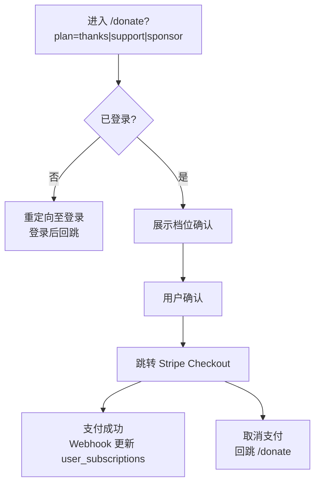

# 捐赠流程详细设计

> 关联总纲：[Cursor.md](../Cursor.md) | 盈利模型：[design-profit-model.md](design-profit-model.md) | 路由：`/donate`

## 概述

捐赠流程允许已登录用户选择档位（Thanks / Support / Sponsor）并完成一次性支付，解锁更多题库。支付通过 Stripe Checkout 处理。

## 路由与权限

| 路由 | 页面 | 是否需要登录 |
|------|------|-------------|
| `/donate` | 捐赠选择与确认 | 是 |

- 未登录用户访问 `/donate` 时，重定向至 `/auth/login?redirect=/donate`（或带 `?plan=` 参数）
- 登录后回跳至捐赠页，保留 `plan` 参数

## 流程概览



## 页面结构

### 捐赠确认页 `/donate`

```
┌─────────────────────────────────────────┐
│              支持 CloudCert               │
├─────────────────────────────────────────┤
│  已选档位：感谢 $4.99                     │
│  解锁 1 个额外题库                        │
│                                         │
│  [ 前往支付 ]  [ 更换档位 ]               │
├─────────────────────────────────────────┤
│  或选择其他档位：                         │
│  ┌─────────┐ ┌─────────┐ ┌─────────┐   │
│  │ 感谢    │ │ 支持    │ │ 赞助    │   │
│  │ $4.99   │ │ $9.99   │ │ $49.99  │   │
│  └─────────┘ └─────────┘ └─────────┘   │
└─────────────────────────────────────────┘
```

### 档位与金额

| plan | 金额 | 题库数 |
|------|------|--------|
| `thanks` | $4.99 | 2 |
| `support` | $9.99 | 3 |
| `sponsor` | $49.99 | 全部 |

## 技术实现要点

### 1. 入口

- Landing Page Pricing 区域：各档位按钮链接至 `/[locale]/donate?plan=thanks|support|sponsor`
- 练习页付费墙：同样链接至 `/donate?plan=X`

### 2. 捐赠页逻辑

- 读取 `plan` 查询参数，校验为 `thanks` | `support` | `sponsor`
- 未登录：重定向至登录，`redirect` 保留当前 URL（含 plan）
- 已登录：展示选中档位、金额、权益说明
- 「前往支付」：调用 API 创建 Stripe Checkout Session，跳转 Stripe 托管页面

### 3. Stripe 集成

- **创建 Session**：API Route 或 Server Action 调用 Stripe `checkout.sessions.create`
  - `mode: "payment"`（一次性支付）
  - `line_items`: 单条，金额与档位对应
  - `success_url`: `/[locale]/donate/success?session_id={CHECKOUT_SESSION_ID}`
  - `cancel_url`: `/[locale]/donate?plan={plan}`
  - `metadata`: `{ plan_type, user_id }` 供 Webhook 使用

- **Webhook**：Supabase Edge Function 或 Next.js API 处理 `checkout.session.completed`
  - 幂等：检查 `stripe_events` 表
  - 写入 `user_subscriptions`（plan_type, status=active, stripe 相关 ID）
  - 记录 `stripe_events`

### 4. 成功页 `/donate/success`

- 展示感谢文案
- 提供「返回仪表盘」「浏览认证」等入口

### 5. 数据库

沿用 `user_subscriptions` 表，`plan_type` 取值 `thanks` | `support` | `sponsor`，`certification_id` 为 NULL（捐赠不绑定单一认证）。

## 多语言

- 档位名称、描述、按钮文案使用 `landing` 下现有 key
- 捐赠页专属文案新增 `donate` 命名空间：`donateTitle`、`donateConfirm`、`donateProceed`、`donateChangePlan`、`donateSuccessTitle` 等

## 响应式

- 移动端：档位卡片单列，确认区域全宽
- 桌面：档位可横向排列
