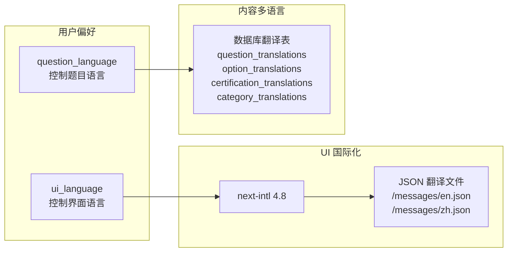
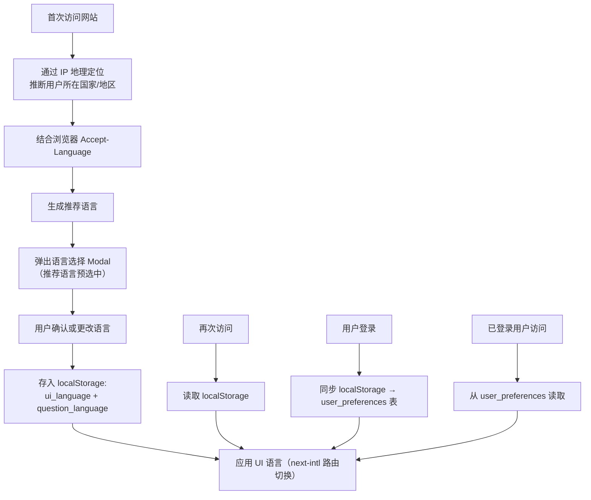

# 多语言策略详细设计

> 关联总纲：[Cursor.md](../Cursor.md) | 贯穿所有页面

## 概述

CloudCert 的多语言分为两个独立层面：**UI 国际化**（网站界面）和**内容多语言**（题目/选项/解析）。用户首次访问时选择偏好语言，登录后同步至数据库。答题过程中可独立切换题目显示语言。

## 双层多语言架构



## UI 国际化（next-intl 4.8）

### 目录结构

```
src/
├── i18n/
│   ├── request.ts          # next-intl 配置
│   └── routing.ts          # 路由配置
├── messages/
│   ├── en.json             # 英文翻译
│   ├── zh.json             # 中文翻译
│   ├── ja.json             # 日文翻译
│   └── ko.json             # 韩文翻译
└── app/
    └── [locale]/           # 国际化路由
        ├── layout.tsx
        ├── page.tsx
        └── ...
```

### 翻译文件示例

```json
{
  "common": {
    "login": "Login",
    "register": "Sign Up",
    "logout": "Logout",
    "search": "Search",
    "loading": "Loading...",
    "error": "Something went wrong",
    "save": "Save",
    "cancel": "Cancel"
  },
  "landing": {
    "hero_title": "Pass Your Cloud Certification with Confidence",
    "hero_subtitle": "Practice with our comprehensive question bank",
    "cta_start": "Start Practicing Free",
    "cta_view": "View Certifications"
  },
  "practice": {
    "submit_answer": "Submit Answer",
    "next_question": "Next Question",
    "correct": "Correct!",
    "incorrect": "Incorrect",
    "explanation": "Explanation",
    "progress": "Progress"
  },
  "wrong_answers": {
    "title": "Wrong Answers",
    "empty": "No wrong answers yet. Keep it up!",
    "redo": "Redo",
    "redo_all": "Redo All",
    "view_detail": "View Detail"
  }
}
```

### 路由策略

使用 next-intl 的国际化路由，URL 前缀标识语言：

| URL | 说明 |
|-----|------|
| `/en/dashboard` | 英文界面的仪表盘 |
| `/zh/dashboard` | 中文界面的仪表盘 |
| `/dashboard` | 默认语言（英文），自动重定向 |

### Middleware 配置

```typescript
// src/middleware.ts
import createMiddleware from 'next-intl/middleware';
import { routing } from './i18n/routing';

export default createMiddleware(routing);

export const config = {
  matcher: ['/', '/(en|zh|ja|ko)/:path*']
};
```

### 组件中使用

```typescript
// Server Component
import { useTranslations } from 'next-intl';

export default function PracticePage() {
  const t = useTranslations('practice');
  return <button>{t('submit_answer')}</button>;
}
```

## 内容多语言（数据库翻译表）

### 翻译表结构

每个内容表都有对应的 `_translations` 表，通过 `language` 字段区分语言：

- `questions` → `question_translations`（题目文本 + 解析）
- `options` → `option_translations`（选项文本）
- `certifications` → `certification_translations`（认证名称 + 描述）
- `categories` → `category_translations`（分类名称 + 描述）

### 查询策略

优先获取用户偏好语言的翻译，回退到英文原文：

```sql
-- 获取题目（带翻译）
SELECT
  q.id,
  COALESCE(qt.question_text, q.question_text) AS question_text,
  COALESCE(qt.explanation, q.explanation) AS explanation,
  q.question_type,
  q.difficulty
FROM questions q
LEFT JOIN question_translations qt
  ON qt.question_id = q.id AND qt.language = $1
WHERE q.id = $2;

-- 获取选项（带翻译）
SELECT
  o.id,
  o.option_label,
  COALESCE(ot.option_text, o.option_text) AS option_text,
  o.is_correct,
  o.sort_order
FROM options o
LEFT JOIN option_translations ot
  ON ot.option_id = o.id AND ot.language = $1
WHERE o.question_id = $2
ORDER BY o.sort_order;
```

### 答题中切换语言

- 答题界面右上角有语言切换按钮（如 `🌐 EN / 中文`）
- 切换时仅重新请求题目和选项的翻译内容，不刷新页面
- 切换结果不影响全局 `question_language` 设置（仅临时）
- 解析区域也有独立的语言切换（参见 [design-explanation.md](design-explanation.md)）

## 语言选择流程



### IP 地理定位推荐语言

首次访问时，通过用户 IP 推断地理位置，结合浏览器语言来推荐最合适的语言。

#### 实现方式

在 Next.js Middleware 中利用 Vercel 自动注入的地理信息 Header：

```typescript
// src/middleware.ts
import { NextRequest } from 'next/server';

function getSuggestedLanguage(request: NextRequest): string {
  // 1. Vercel 自动注入的地理信息（无需额外 API 调用）
  const country = request.geo?.country; // e.g. 'CN', 'JP', 'KR', 'US'

  // 2. 国家 → 语言映射
  const countryToLanguage: Record<string, string> = {
    CN: 'zh', TW: 'zh', HK: 'zh',  // 中文地区
    JP: 'ja',                        // 日本
    KR: 'ko',                        // 韩国
  };

  const geoLang = country ? countryToLanguage[country] : undefined;

  // 3. 回退到浏览器 Accept-Language
  const acceptLang = request.headers.get('accept-language');
  const browserLang = acceptLang?.split(',')[0]?.split('-')[0]; // e.g. 'zh'

  // 4. 优先级：IP 地理定位 > 浏览器语言 > 默认英文
  return geoLang || (browserLang && supportedLocales.includes(browserLang) ? browserLang : 'en');
}
```

#### 语言选择 Modal

首次访问弹出 Modal 时，推荐语言已预选中：

```
┌─────────────────────────────────────┐
│       Choose Your Language          │
│                                     │
│  We detected you might prefer:      │
│                                     │
│  ● 中文 (Chinese)     ← 推荐       │
│  ○ English                          │
│                                     │
│  This will set both the website     │
│  interface and default question     │
│  language. You can change it later  │
│  in Settings.                       │
│                                     │
│         [ Confirm ]                 │
└─────────────────────────────────────┘
```

#### 注意事项

- Vercel 部署时 `request.geo` 自动可用，无需额外第三方 GeoIP 服务
- IP 地理定位仅作为推荐依据，用户可自由更改
- VPN 用户可能收到错误推荐，因此必须允许手动选择
- 推荐结果存入 cookie `suggested_locale`，避免 Modal 重复弹出

### 偏好存储优先级

1. **已登录用户**：从 `user_preferences` 表读取
2. **未登录用户**：从 `localStorage` 读取
3. **首次访问**：IP 地理定位 → 浏览器语言 → 弹出选择 Modal（推荐语言预选中）

## 支持语言

| 语言代码 | 语言 | UI 翻译 | 内容翻译 |
|---------|------|---------|---------|
| `en` | English | ✅ | ✅（基础语言） |
| `zh` | 中文 | ✅ | ✅ |
| `ja` | 日本語 | ✅ | ✅ |
| `ko` | 한국어 | ✅ | ✅ |

### 扩展新语言

添加新语言时需要：
1. 添加 `/messages/{lang}.json` 翻译文件
2. 更新 next-intl routing 配置的 `locales` 数组
3. 更新 `middleware.ts` 的 matcher 和 locale 正则
4. 在数据库翻译表中添加对应语言的翻译记录
5. 更新 Navbar 的 `localeOptions` 数组

## 各语言字体配置

每种语言使用最适合其文字系统的字体，按 locale 动态加载以优化性能：

| 语言 | 字体 | CSS 变量 | 说明 |
|------|------|---------|------|
| English | Plus Jakarta Sans | `--font-plus-jakarta` | 现代圆润无衬线体，默认字体 |
| 中文 | Noto Sans SC | `--font-noto-sc` | 思源黑体，专业简体中文字体 |
| 日本語 | Zen Kaku Gothic New | `--font-zen-kaku` | 精致现代日文哥特体 |
| 한국어 | Gothic A1 | `--font-gothic-a1` | 韩国本土流行字体 |
| 代码 | JetBrains Mono | `--font-jetbrains-mono` | 所有语言共用等宽字体 |

- CJK 字体设置 `preload: false`，仅在对应 locale 页面时由浏览器按需下载
- 通过 `html[lang="xx"]` CSS 选择器覆盖默认字体，确保正确继承

## 技术实现要点

- next-intl 4.8 原生支持 Next.js 16 App Router 和 Server Components
- UI 翻译文件使用 ICU Message Syntax，支持复数、日期等格式化
- 内容翻译通过 `LEFT JOIN` 实现回退机制，无翻译时自动显示英文
- 语言切换不触发全页刷新，通过 `useRouter` 切换 locale 路由段
- 缓存策略：相同语言的翻译内容在客户端缓存，减少重复请求
