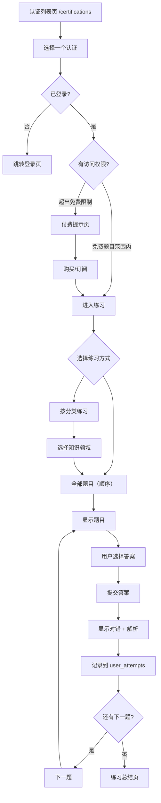

# 练习模式详细设计

> 关联总纲：[Cursor.md](../Cursor.md) | 路由：`/certifications`、`/practice/[certId]`

## 概述

练习模式是 CloudCert 的核心功能，用户选择一个认证题库后按顺序逐题作答。系统提供实时反馈、详细解析，并记录每次答题结果用于错题本和进度追踪。不提供随机抽题功能。

## 用户流程



## 页面设计

### 认证列表页 (`/certifications`)

- **布局**：网格卡片展示所有认证
- **卡片内容**：
  - 认证图标（如 AWS Logo）
  - 认证名称（多语言）
  - 所属厂商（AWS / Azure / GCP）
  - 题目总数
  - 免费题目数量
  - 用户已完成进度（已登录时显示进度条）
  - 状态标签："Available" 或 "Coming Soon"
- **筛选**：按厂商筛选（AWS / Azure / GCP / All）
- **排序**：默认按推荐排序
- **访客模式**：未登录用户可浏览列表，点击进入时提示登录

### 练习页面 (`/practice/[certId]`)

#### 练习入口（认证详情页）

- 显示认证信息概览（名称、总题数、已完成数、正确率）
- **错题快捷入口**：显示该认证的错题数量，点击跳转到 `/wrong-answers?cert=[certCode]`（自动按该认证筛选）
- 练习方式选择：
  - **全部题目**：从第 1 题按顺序开始（如有历史记录，可选择从上次位置继续）
  - **按分类**：展示各知识领域分类列表，每个分类显示题数和完成情况

```
┌──────────────────────────────────────────────────────┐
│  ← Back                                    🌐 EN    │
│──────────────────────────────────────────────────────│
│                                                      │
│  [AWS Logo]  AWS Solutions Architect Associate        │
│                                                      │
│  ┌────────────┐ ┌────────────┐ ┌────────────┐       │
│  │ Progress   │ │ Correct    │ │ Wrong      │       │
│  │ 156 / 350  │ │ Rate 72%   │ │ 43 errors  │       │
│  │ ████░░░░░  │ │            │ │ [Review →] │       │
│  └────────────┘ └────────────┘ └────────────┘       │
│                                                      │
│  ── Practice Mode ──────────────────────────────────│
│                                                      │
│  [ ▶ Continue from Q157 ]   [ ↺ Start from Q1 ]    │
│                                                      │
│  ── By Category ────────────────────────────────────│
│                                                      │
│  Compute        45/60   ████████░░  75%              │
│  Storage        32/50   ██████░░░░  64%              │
│  Networking     28/40   ███████░░░  70%              │
│  ...                                                 │
│                                                      │
└──────────────────────────────────────────────────────┘
```

#### 答题界面（Desktop 双栏布局）

Desktop 端采用左右双栏布局：左侧为答题区域，右侧固定显示答题卡片。

```
┌────────────────────────────────────────────────────────────────────────────┐
│  ← Back        AWS SAA        Q 12/65                          🌐 EN     │
│────────────────────────────────────────────────────────────────────────────│
│                                            │                              │
│  Category: Compute                         │  Answer Card                 │
│                                            │                              │
│  Question 12:                              │  ✅ 8  ❌ 3  ⬜ 54  Total 65 │
│  Which AWS service provides resizable      │                              │
│  compute capacity in the cloud?            │  ┌───┬───┬───┬───┬───┐      │
│                                            │  │ 1 │ 2 │ 3 │ 4 │ 5 │      │
│  ┌────────────────────────────────────┐    │  │ ✅│ ✅│ ❌│ ✅│ ✅│      │
│  │ ○ A. Amazon S3                    │    │  ├───┼───┼───┼───┼───┤      │
│  ├────────────────────────────────────┤    │  │ 6 │ 7 │ 8 │ 9 │10 │      │
│  │ ● B. Amazon EC2                   │    │  │ ❌│ ✅│ ✅│ ❌│ ✅│      │
│  ├────────────────────────────────────┤    │  ├───┼───┼───┼───┼───┤      │
│  │ ○ C. Amazon RDS                   │    │  │11 │*12│13 │14 │15 │      │
│  ├────────────────────────────────────┤    │  │ ✅│ ▶ │ ⬜│ 🔒│ 🔒│      │
│  │ ○ D. AWS Lambda                   │    │  ├───┼───┼───┼───┼───┤      │
│  └────────────────────────────────────┘    │  │16 │17 │18 │19 │20 │      │
│                                            │  │ 🔒│ 🔒│ 🔒│ 🔒│ 🔒│      │
│         [ Submit Answer ]                  │  ├───┴───┴───┴───┴───┤      │
│                                            │  │       ...         │      │
│                                            │  └───────────────────┘      │
│                                            │                              │
│                                            │  Legend:                     │
│                                            │  ✅ Correct  ❌ Wrong       │
│                                            │  ▶ Current   ⬜ Unanswered  │
│                                            │  🔒 Locked                   │
│────────────────────────────────────────────────────────────────────────────│
│  Progress: ████████░░░░  12/65                                            │
└────────────────────────────────────────────────────────────────────────────┘
```

#### 答题界面（Mobile 单栏布局）

Mobile/Tablet 端为单栏布局，答题卡片通过导航栏的 "📋" 按钮从底部滑出 Sheet 面板。

```
┌──────────────────────────────────────┐
│  ← Back   AWS SAA  Q12/65  📋  🌐   │
│──────────────────────────────────────│
│                                      │
│  Category: Compute                   │
│                                      │
│  Question 12:                        │
│  Which AWS service provides          │
│  resizable compute capacity          │
│  in the cloud?                       │
│                                      │
│  ┌──────────────────────────────┐    │
│  │ ○ A. Amazon S3              │    │
│  ├──────────────────────────────┤    │
│  │ ● B. Amazon EC2             │    │
│  ├──────────────────────────────┤    │
│  │ ○ C. Amazon RDS             │    │
│  ├──────────────────────────────┤    │
│  │ ○ D. AWS Lambda             │    │
│  └──────────────────────────────┘    │
│                                      │
│         [ Submit Answer ]            │
│                                      │
│──────────────────────────────────────│
│  Progress: ████████░░░░  12/65       │
└──────────────────────────────────────┘
```

#### 答题卡片（Answer Card）

答题卡片以网格形式展示所有题号，通过颜色和图标标识每题的作答状态，用户可点击任意题号直接跳转。

##### 题号状态说明

| 状态 | 样式 | 说明 |
|------|------|------|
| ✅ Correct | 绿色背景 | 已作答且回答正确 |
| ❌ Wrong | 红色背景 | 已作答且回答错误 |
| ▶ Current | 蓝色边框高亮 | 当前正在查看/作答的题目 |
| ⬜ Unanswered | 灰色/无背景 | 尚未作答 |
| 🔒 Locked | 灰色 + 锁定图标 | 付费题目，未解锁 |

##### 交互行为

| 操作 | 行为 |
|------|------|
| 点击已作答题号（✅/❌） | 跳转到该题目，显示已提交的答案和解析（只读回顾模式） |
| 点击未作答题号（⬜） | 跳转到该题目，进入作答状态 |
| 点击当前题号（▶） | 无操作（已在当前题目） |
| 点击锁定题号（🔒） | 触发付费提示弹窗 |

##### 展示方式

- **Desktop (>=1024px)**：答题卡片始终固定显示在题目右侧，双栏布局（左 70% 题目 + 右 30% 卡片），卡片区域使用 `position: sticky` 固定在视口内，题目区域可独立滚动
- **Tablet (768-1023px)**：单栏布局，导航栏显示 "📋" 按钮，点击从右侧滑出答题卡片 Drawer
- **Mobile (<768px)**：单栏布局，导航栏显示 "📋" 按钮，点击从底部滑出 Sheet 面板

##### 统计摘要

答题卡片顶部显示实时统计：
- Correct 数量（绿色）
- Wrong 数量（红色）
- Unanswered 数量（灰色）
- Total 总题数

#### 答题界面元素

| 元素 | 说明 |
|------|------|
| 导航栏 | 返回按钮、认证名称、当前题号/总题数、答题卡片按钮、语言切换按钮 |
| 分类标签 | 当前题目所属知识领域 |
| 题目文本 | 支持多语言显示，可切换英文/偏好语言 |
| 选项列表 | 单选（Radio）或多选（Checkbox），根据 `question_type` 决定 |
| 提交按钮 | 选择后激活，点击提交答案 |
| 进度条 | 底部进度条显示当前完成比例 |
| 答题卡片 | 网格展示所有题号状态，支持点击跳转（侧边栏/Sheet） |

#### 答案反馈界面

提交答案后立即显示反馈：

- **正确**：选项背景变绿，显示 ✅
- **错误**：用户选项变红 ❌，正确选项变绿 ✅
- **解析区域**：展示详细解析（参见 [design-explanation.md](design-explanation.md)）
- **操作按钮**："Next Question" 进入下一题

#### 练习总结页

完成所有题目（或退出时）显示总结：

- 总答题数
- 正确数 / 错误数
- 正确率（百分比 + 环形图）
- 各分类正确率分布（柱状图）
- 错题列表快捷入口
- 操作按钮："Review Wrong Answers" / "Back to Certifications"

## 数据模型

### 答题记录写入

```sql
INSERT INTO user_attempts (user_id, question_id, selected_option_ids, is_correct, attempted_at)
VALUES ($1, $2, $3, $4, NOW());
```

### 查询用户进度

```sql
-- 某认证的完成进度
SELECT COUNT(DISTINCT ua.question_id) AS completed,
       COUNT(DISTINCT q.id) AS total
FROM questions q
LEFT JOIN user_attempts ua ON ua.question_id = q.id AND ua.user_id = $1
WHERE q.certification_id = $2;
```

### 获取用户上次练习位置

```sql
-- 获取最后答过的题目 sort_order，从下一题继续
SELECT q.sort_order
FROM user_attempts ua
JOIN questions q ON q.id = ua.question_id
WHERE ua.user_id = $1 AND q.certification_id = $2
ORDER BY ua.attempted_at DESC
LIMIT 1;
```

## 免费 / 付费访问控制

- 每个认证的 `free_question_limit` 字段决定免费题目数量（10~20）
- 题目表的 `is_free` 字段标记哪些题目免费
- 前端：超出免费范围的题目显示锁定图标，点击触发付费提示
- 后端：RLS Policy 确保未付费用户无法获取付费题目内容

```sql
CREATE POLICY "Users can access free or purchased questions"
  ON questions FOR SELECT
  USING (
    is_free = true
    OR EXISTS (
      SELECT 1 FROM user_subscriptions
      WHERE user_id = auth.uid()
      AND (
        certification_id = questions.certification_id
        OR plan_type IN ('monthly', 'yearly')
      )
      AND status = 'active'
    )
  );
```

## 安全性设计

### `is_correct` 字段保护

`options.is_correct` 字段**不得在用户提交答案前发送到客户端**，否则用户可通过 DevTools 查看正确答案。

- Server Component 预加载题目时，**过滤掉** `is_correct` 字段
- 提交答案后由 Server Action / API Route 判定正误，再返回正确答案和解析
- RLS 层面不直接暴露 `is_correct`，通过 Database Function 封装判定逻辑

```sql
-- 答题时获取选项（不包含 is_correct）
SELECT id, option_label, option_text, sort_order
FROM options
WHERE question_id = $1
ORDER BY sort_order;
```

### 答案验证 API

答案验证统一使用 **API Route**（`POST /api/submit-answer`），而非 Server Action。原因：

- 第二阶段 React Native iOS App 可直接复用同一 API
- REST 风格便于测试和文档化
- 可统一做 Rate Limiting

```typescript
// POST /api/submit-answer
// Request: { questionId: string, selectedOptionIds: string[] }
// Response: { isCorrect: boolean, correctOptionIds: string[], explanation: string }
```

## 技术实现要点

- 题目数据通过 Server Component 预加载，减少客户端请求（**注意：不返回 `is_correct` 字段**）
- 答题交互（选择、提交）使用 Client Component
- 语言切换实时请求对应翻译内容，无需刷新页面
- 答题记录异步写入，不阻塞 UI
- 练习进度在客户端使用 `useState` + `useReducer` 管理，维护一个 `Map<questionIndex, {status, selectedOptions}>` 结构
- 答题卡片的状态数据从 `useReducer` 的 state 中派生，跳转通过更新 `currentQuestionIndex` 实现
- 点击已答题目进入只读回顾模式，显示用户选择和解析但不可重新提交
- 答题卡片面板使用 Framer Motion 12 实现侧边栏滑入（Desktop）/ 底部 Sheet 滑出（Mobile）动画
- 离开页面时自动保存当前位置
- **多标签页冲突处理**：使用 `BroadcastChannel API` 检测多标签页，显示提示 "Practice session is active in another tab"
- **网络异常处理**：答题记录先写入 `localStorage` 队列，网络恢复后自动同步到服务端；显示网络状态提示条

## 响应式设计

| 断点 | 布局调整 |
|------|---------|
| Desktop (≥1024px) | 双栏布局：左侧题目区域（70%）+ 右侧答题卡片（30%，sticky 固定），题目区域最大宽度 800px |
| Tablet (768-1023px) | 单栏布局，题目居中，答题卡片通过 "📋" 按钮从右侧 Drawer 滑出 |
| Mobile (<768px) | 单栏全宽，选项卡片加大触控区域，底部固定提交按钮，答题卡片通过 "📋" 按钮从底部 Sheet 滑出 |
