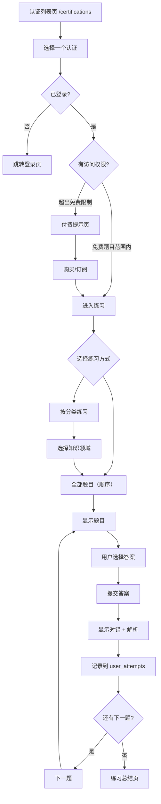

# 练习模式详细设计

> 关联总纲：[Cursor.md](../Cursor.md) | 路由：`/certifications`、`/certifications/[certId]`  
> 计划与实现差距（未做项清单）：[practice-not-done.md](practice-not-done.md)

## 概述

练习模式是 CloudCert 的核心功能，用户选择一个认证题库后按顺序逐题作答。系统提供实时反馈、详细解析，并记录每次答题结果用于错题本和进度追踪。不提供随机抽题功能。

## 用户流程



## 页面设计

### 认证列表页 (`/certifications`)

#### 页面头部（Hero Header）

- 渐变背景区域（`bg-gradient-to-br from-primary/5`），内含装饰性模糊圆形
- 居中布局：BookOpen 图标 → 页面标题（`text-3xl` ~ `text-5xl`）→ 副标题
- 入场动画：spring 弹入（stiffness: 200, damping: 20）

#### 厂商筛选栏（Filter Tabs）

- 水平排列的圆角 Pill 按钮：All / AWS / Azure / GCP
- 各厂商 Tab 内含对应 SVG Logo（`CloudProviderLogos` 组件，16px）
- 选中态：厂商专属配色背景 + ring 边框（如 AWS 为 `bg-orange-50 ring-orange-300`）；All 使用 `bg-primary`
- 未选中态：`bg-muted/60 text-muted-foreground`，hover 时加深

#### 认证卡片（Certification Card）

- **布局**：响应式网格（Mobile 单列 / Tablet 双列 / Desktop 三列），卡片等高
- **结构**（从上到下）：
  1. **渐变顶部色条**：`h-1.5` 厂商专属渐变色（AWS: orange→amber, Azure: sky→blue, GCP: blue→indigo）
  2. **Logo + 状态徽章**：左侧 56×56px 圆角容器内的 SVG 厂商 Logo（`CloudProviderLogos`），右侧 "Available" 绿色 Pill 徽章（含 ✓ Check 图标）
  3. **标题**：认证名称（`text-lg font-semibold`）+ 厂商名（`text-sm text-muted-foreground`）
  4. **描述**：认证描述文本，`line-clamp-2` 截断
  5. **统计行**：BookOpen 图标 + 题目总数、Gift 图标 + 免费题目数
  6. **进度条**（已登录且有进度时）：数字标签（`answered/total (percent%)`）+ 厂商配色渐变进度条（带动画填充）
  7. **行动按钮**："Start practice" + ChevronRight 箭头，hover 时箭头右移
- **交互**：hover 时卡片上移 4px + 增大阴影（`hover:shadow-lg hover:-translate-y-1`）
- **动画**：spring 弹入（stiffness: 260, damping: 24），进度条延迟 0.8s ease-out 填充
- **边框**：厂商专属色（如 AWS 为 `border-orange-200/70`），hover 时加深

#### 空状态

- 居中圆形图标容器（Search 图标）+ 文案提示
- 虚线边框 + 淡背景

#### 访客模式

- 未登录用户可浏览列表，点击进入时提示登录

#### 排序

- 默认按题目总数降序（推荐排序）

### 认证详情 / 练习入口页 (`/certifications/[certId]`)

> 路由从 `/practice/[certId]` 迁移至 `/certifications/[certId]`，作为认证列表的子路由。

#### Hero Header（认证信息横幅）

- 全宽渐变背景区域，厂商专属配色（AWS: `from-orange-500/8`, Azure: `from-sky-500/8`, GCP: `from-blue-500/8`）
- 装饰性模糊圆形（pointer-events-none）
- 内含返回链接（← Back to certifications）
- 左侧 64×64px 圆角容器内的 SVG 厂商 Logo（`CloudProviderLogos`），阴影
- 认证名称（`text-2xl` ~ `text-4xl font-bold`）+ 厂商名（muted-foreground）
- 入场动画：spring 弹入（stiffness: 200, damping: 20）

#### 统计概览卡片（Stats Overview）

- 3 列网格，每张卡片带 shadow-sm + 圆角边框
- **Progress**：Target 图标（primary/10 背景），`answered / total` 大数字，厂商配色渐变进度条（animated fill 0.8s），百分比标签
- **Correct Rate**：TrendingUp 图标（green/10 背景），百分比数字颜色分级（≥70% 绿，≥40% 黄，<40% 红）
- **Wrong Answers**：AlertCircle 图标（red/10 背景），错题数 + "Review wrong answers →" 链接
- 每张卡片使用 staggered 入场动画（0.06s 间隔）

#### 练习模式操作区

- 白色卡片容器（`rounded-xl border bg-card shadow-sm`），内含标题 + 操作按钮组
- **Continue from Q{n}**（有进度时显示，Primary 按钮 + Play 图标）
- **Start from Q1**（有进度时 Outline，无进度时 Primary + RotateCcw 图标）
- **Memorization Mode**（Outline 按钮 + BookOpen 图标，替换之前的 📖 emoji）

#### 分类列表（Category List）

- FolderOpen 图标 + 标题
- 每行为带有 **厂商配色左边框**（`border-l-4`，如 AWS 为 `border-l-orange-400`）的卡片
- 分类名称 + `answered/total` + 厂商配色渐变进度条（animated fill）+ 百分比
- Hover：卡片上移 2px + 增大阴影
- 每行 staggered 入场动画（slide-in from left, 0.04s 间隔）
- 点击跳转 `/certifications/[certId]?mode=category&category=[catId]`

#### 答题界面（Desktop 双栏布局）

Desktop 端采用左右双栏布局：左侧为答题区域，右侧固定显示答题卡片。

```
┌────────────────────────────────────────────────────────────────────────────┐
│  ← Back                    [◀][➤][⚙][📋]  AWS SAA  Q 12/65    🌐 EN     │
│────────────────────────────────────────────────────────────────────────────│
│                                            │                              │
│  Category: Compute                         │  Answer Card                 │
│                                            │                              │
│  Question 12:                              │  ✅ 8  ❌ 3  ⬜ 54  Total 65 │
│  Which AWS service provides resizable      │                              │
│  compute capacity in the cloud?            │  ┌───┬───┬───┬───┬───┐      │
│                                            │  │ 1 │ 2 │ 3 │ 4 │ 5 │      │
│  ┌────────────────────────────────────┐    │  │ ✅│ ✅│ ❌│ ✅│ ✅│      │
│  │ ○ A. Amazon S3                    │    │  ├───┼───┼───┼───┼───┤      │
│  ├────────────────────────────────────┤    │  │ 6 │ 7 │ 8 │ 9 │10 │      │
│  │ ● B. Amazon EC2                   │    │  │ ❌│ ✅│ ✅│ ❌│ ✅│      │
│  ├────────────────────────────────────┤    │  ├───┼───┼───┼───┼───┤      │
│  │ ○ C. Amazon RDS                   │    │  │11 │*12│13 │14 │15 │      │
│  ├────────────────────────────────────┤    │  │ ✅│ ▶ │ ⬜│ 🔒│ 🔒│      │
│  │ ○ D. AWS Lambda                   │    │  ├───┼───┼───┼───┼───┤      │
│  └────────────────────────────────────┘    │  │16 │17 │18 │19 │20 │      │
│                                            │  │ 🔒│ 🔒│ 🔒│ 🔒│ 🔒│      │
│         [ Submit Answer ]                  │  ├───┴───┴───┴───┴───┤      │
│                                            │  │       ...         │      │
│                                            │  └───────────────────┘      │
│                                            │                              │
│                                            │  Legend:                     │
│                                            │  ✅ Correct  ❌ Wrong       │
│                                            │  ▶ Current   ⬜ Unanswered  │
│                                            │  🔒 Locked                   │
│────────────────────────────────────────────────────────────────────────────│
│  Progress: ████████░░░░  12/65                                            │
└────────────────────────────────────────────────────────────────────────────┘
```

#### 答题界面（Mobile 单栏布局）

Mobile/Tablet 端为单栏布局，答题卡片通过导航栏的 "📋" 按钮从底部滑出 Sheet 面板。

```
┌──────────────────────────────────────┐
│  ← Back   AWS SAA  Q12/65  📋  🌐   │
│──────────────────────────────────────│
│                                      │
│  Category: Compute                   │
│                                      │
│  Question 12:                        │
│  Which AWS service provides          │
│  resizable compute capacity          │
│  in the cloud?                       │
│                                      │
│  ┌──────────────────────────────┐    │
│  │ ○ A. Amazon S3              │    │
│  ├──────────────────────────────┤    │
│  │ ● B. Amazon EC2             │    │
│  ├──────────────────────────────┤    │
│  │ ○ C. Amazon RDS             │    │
│  ├──────────────────────────────┤    │
│  │ ○ D. AWS Lambda             │    │
│  └──────────────────────────────┘    │
│                                      │
│         [ Submit Answer ]            │
│                                      │
│──────────────────────────────────────│
│  Progress: ████████░░░░  12/65       │
└──────────────────────────────────────┘
```

#### 答题卡片（Answer Card）

答题卡片以网格形式展示所有题号，通过颜色和图标标识每题的作答状态，用户可点击任意题号直接跳转。

##### 题型分组

- **单选 (Single Choice)** 与 **多选 (Multiple Choice)** 分开展示，各自独立区块
- 每种题型内部展示 **从 1 开始的序号**（第 1 题、第 2 题…，仅在该题型组内连续）
- 若某题型无题目，则不显示该区块

##### 题目语言

- 服务端按 **英文 (`en`)** 与 **`user_preferences.question_language`**（未登录则使用当前站点 `locale`）拉取题干、选项与解析，客户端用分段按钮在两种语言间切换（若两者相同则隐藏切换器）。
- 同一请求中一并查询选项的 **`is_correct`**，组装每题的 **`correctOptionIds`**，供练习模式展示与「选满即判题」使用，避免答题页再请求答案接口造成卡顿。

##### 练习偏好

- **答对自动下一题**、**练习模式（直接显示解析，不提交、不记 `user_attempts`）** 可在 **设置页** 与 **答题页 Popover** 中开关，并写入 `user_preferences`（已登录）及 `localStorage` 同步。

##### 可滚动区域

- 中间的题号网格区域为可滚动列表（max-height: 400px），题量多时可纵向滚动

##### 动画规范

- 答题卡片进入使用 Framer Motion 淡入 + 上移（200ms ease-out）
- 题号状态变化（correct/wrong/current）使用 spring 过渡
- 与 design-ux-standards 一致

##### 题号网格布局

- 使用 **固定列数**（如 5～6 列）+ 固定最小格宽，避免题目极少时出现「整行被两格对半平分」的观感。

##### 题号状态说明

| 状态 | 样式 | 说明 |
|------|------|------|
| ✅ Correct | 绿色背景 | 已作答且回答正确 |
| ❌ Wrong | 红色背景 | 已作答且回答错误 |
| ▶ Current | **主色 ring**（与 ✅/❌/⬜ 叠加，不覆盖底色） | 当前正在查看的题目；与顶部 ✓/✗ 统计一致 |
| ⬜ Unanswered | 灰色/无背景 | 尚未作答 |
| 🔒 Locked | 灰色 + 锁定图标 | 付费题目，未解锁 |

##### 交互行为

| 操作 | 行为 |
|------|------|
| 点击已作答题号（✅/❌） | 跳转到该题目，显示已提交的答案和解析（只读回顾模式） |
| 点击未作答题号（⬜） | 跳转到该题目，进入作答状态 |
| 点击当前题号（▶） | 无操作（已在当前题目） |
| 点击锁定题号（🔒） | 触发付费提示弹窗 |

##### 展示方式

- **Desktop (>=1024px)**：答题卡片始终固定显示在题目右侧，双栏布局（左 70% 题目 + 右 30% 卡片），卡片区域使用 `position: sticky` 固定在视口内，题目区域可独立滚动
- **Tablet (768-1023px)**：单栏布局，导航栏显示 "📋" 按钮，点击从右侧滑出答题卡片 Drawer
- **Mobile (<768px)**：单栏布局，导航栏显示 "📋" 按钮，点击从底部滑出 Sheet 面板

##### 统计摘要

答题卡片顶部显示实时统计：
- Correct 数量（绿色）
- Wrong 数量（红色）
- Unanswered 数量（灰色）
- Total 总题数

#### 信息文本颜色

| 元素 | 颜色 | 说明 |
|------|------|------|
| 分类标签 (Category) | `text-primary` | 突出知识领域 |
| 题号 (Question N of Total) | `text-muted-foreground` | 次要信息 |
| 题目正文 | `text-foreground` | 主内容 |
| 解析标题 | `text-primary` | 与主色一致 |
| 解析内容 | `text-foreground/90` | 略深于 muted，提升可读性 |

#### 操作按钮（顶部图标栏）

- **位置**：导航栏右侧，认证名称与题号之前
- **样式**：全部为图标按钮（icon-only），无文字
- **按钮顺序**：上一题（◀）、提交/下一题（➤）、设置（⚙）、答题卡（📋，仅移动端）
- **图标**：ChevronLeft（上一题）、Send（提交）、ChevronRight（下一题）、Settings（设置）、ClipboardList（答题卡）

#### 用户偏好：答对自动下一题

- 设置项：`autoNextOnCorrect`（默认 `true`）
- **开启**：答对后约 600ms 自动进入下一题
- **关闭**：答对后显示解析，用户手动点击「下一题」
- **入口**：点击设置图标（⚙）打开 Popover 弹出层，在弹出层内切换 On/Off，持久化到 `localStorage`

#### 上一题 / 下一题

- 上一题：`currentIndex > 0` 时可用
- 下一题：未提交时显示提交按钮；已提交时显示下一题；`currentIndex >= total - 1` 时显示「完成」并跳转仪表盘

#### 背题模式（Memorization Mode）

- 练习入口提供「背题模式」按钮，URL 参数 `mode=memorization`
- 进入后直接显示正确选项和解析，无需选择、无需提交
- API：`GET /api/question-answer?questionId=xxx`，返回 `{ correctOptionIds, explanation }`
- 需校验题目访问权限（免费/已购买）
- 不写入 `user_attempts`

#### 错误处理

- 提交失败时显示红色提示条 + 重试按钮

#### 滚动行为

- **切换题目**：切换题目时 `window.scrollTo({ top: 0, behavior: "smooth" })`，页面滚动到顶部
- **切换页面**：路由变化时通过 `ScrollToTop` 组件自动滚动到顶部（参见 layout）

#### 答题界面元素

| 元素 | 说明 |
|------|------|
| 导航栏 | 返回链接、操作图标栏（上一题/提交或下一题/设置/答题卡）、认证名称、当前题号/总题数 |
| 分类标签 | 当前题目所属知识领域 |
| 题目文本 | 支持多语言显示，可切换英文/偏好语言 |
| 选项列表 | 单选（Radio）或多选（Checkbox），根据 `question_type` 决定 |
| 提交/下一题 | 图标按钮，位于顶部；选择后激活提交，已提交后显示下一题 |
| 设置 Popover | 点击设置图标打开，内含「答对自动下一题」开关 |
| 进度条 | 底部进度条显示当前完成比例 |
| 答题卡片 | 网格展示所有题号状态，支持点击跳转（侧边栏/Sheet） |

#### 答案反馈界面

提交答案后立即显示反馈：

- **正确**：选项背景变绿，显示 ✅
- **错误**：用户选项变红 ❌，正确选项变绿 ✅
- **解析区域**：展示详细解析（参见 [design-explanation.md](design-explanation.md)）
- **操作按钮**："Next Question" 进入下一题

#### 练习总结页

完成所有题目（或退出时）显示总结：

- 总答题数
- 正确数 / 错误数
- 正确率（百分比 + 环形图）
- 各分类正确率分布（柱状图）
- 错题列表快捷入口
- 操作按钮："Review Wrong Answers" / "Back to Certifications"

## 数据模型

### 答题记录写入

```sql
INSERT INTO user_attempts (user_id, question_id, selected_option_ids, is_correct, attempted_at)
VALUES ($1, $2, $3, $4, NOW());
```

### 查询用户进度

```sql
-- 某认证的完成进度
SELECT COUNT(DISTINCT ua.question_id) AS completed,
       COUNT(DISTINCT q.id) AS total
FROM questions q
LEFT JOIN user_attempts ua ON ua.question_id = q.id AND ua.user_id = $1
WHERE q.certification_id = $2;
```

### 获取用户上次练习位置

```sql
-- 获取最后答过的题目 sort_order，从下一题继续
SELECT q.sort_order
FROM user_attempts ua
JOIN questions q ON q.id = ua.question_id
WHERE ua.user_id = $1 AND q.certification_id = $2
ORDER BY ua.attempted_at DESC
LIMIT 1;
```

## 免费 / 付费访问控制

- 每个认证的 `free_question_limit` 字段决定免费题目数量（10~20）
- 题目表的 `is_free` 字段标记哪些题目免费
- 前端：超出免费范围的题目显示锁定图标，点击触发付费提示
- 后端：RLS Policy 确保未付费用户无法获取付费题目内容

```sql
CREATE POLICY "Users can access free or purchased questions"
  ON questions FOR SELECT
  USING (
    is_free = true
    OR EXISTS (
      SELECT 1 FROM user_subscriptions
      WHERE user_id = auth.uid()
      AND (
        certification_id = questions.certification_id
        OR plan_type IN ('monthly', 'yearly')
      )
      AND status = 'active'
    )
  );
```

## 安全性设计

### `is_correct` 字段保护

`options.is_correct` 字段**不得在用户提交答案前发送到客户端**，否则用户可通过 DevTools 查看正确答案。

- Server Component 预加载题目时，**过滤掉** `is_correct` 字段
- 提交答案后由 Server Action / API Route 判定正误，再返回正确答案和解析
- RLS 层面不直接暴露 `is_correct`，通过 Database Function 封装判定逻辑

```sql
-- 答题时获取选项（不包含 is_correct）
SELECT id, option_label, option_text, sort_order
FROM options
WHERE question_id = $1
ORDER BY sort_order;
```

### 答案验证 API

答案验证统一使用 **API Route**（`POST /api/submit-answer`），而非 Server Action。原因：

- 第二阶段 React Native iOS App 可直接复用同一 API
- REST 风格便于测试和文档化
- 可统一做 Rate Limiting

```typescript
// POST /api/submit-answer
// Request: { questionId: string, selectedOptionIds: string[] }
// Response: { isCorrect: boolean, correctOptionIds: string[], explanation: string }
```

## 技术实现要点

- 题目数据通过 Server Component 预加载，减少客户端请求（**注意：不返回 `is_correct` 字段**）
- 答题交互（选择、提交）使用 Client Component
- 语言切换实时请求对应翻译内容，无需刷新页面
- 答题记录异步写入，不阻塞 UI
- 练习进度在客户端使用 `useState` + `useReducer` 管理，维护一个 `Map<questionIndex, {status, selectedOptions}>` 结构
- 答题卡片的状态数据从 `useReducer` 的 state 中派生，跳转通过更新 `currentQuestionIndex` 实现
- 点击已答题目进入只读回顾模式，显示用户选择和解析但不可重新提交
- 答题卡片面板使用 Framer Motion 12 实现侧边栏滑入（Desktop）/ 底部 Sheet 滑出（Mobile）动画
- 离开页面时自动保存当前位置
- **多标签页冲突处理**：使用 `BroadcastChannel API` 检测多标签页，显示提示 "Practice session is active in another tab"
- **网络异常处理**：答题记录先写入 `localStorage` 队列，网络恢复后自动同步到服务端；显示网络状态提示条

## 响应式设计

| 断点 | 布局调整 |
|------|---------|
| Desktop (≥1024px) | 双栏布局：左侧题目区域（70%）+ 右侧答题卡片（30%，sticky 固定），题目区域最大宽度 800px |
| Tablet (768-1023px) | 单栏布局，题目居中，答题卡片通过 "📋" 按钮从右侧 Drawer 滑出 |
| Mobile (<768px) | 单栏全宽，选项卡片加大触控区域，底部固定提交按钮，答题卡片通过 "📋" 按钮从底部 Sheet 滑出 |
