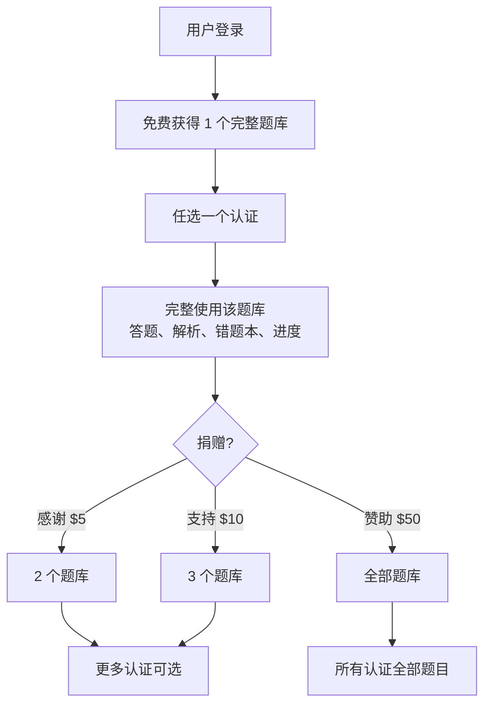

# 盈利模式详细设计

> 关联总纲：[Cursor.md](../Cursor.md) | 涉及页面：Landing Page Pricing、`/settings`、练习页面付费墙

## 概述

CloudCert 采用**捐赠驱动**模式：登录用户免费获得 1 个完整题库，通过捐赠解锁更多。支付渠道支持 Stripe 信用卡。整体风格偏**捐赠感**，使用整数金额与感谢类命名。

## 核心模型



## 档位与定价（.99 心理定价）

| 档位 | 金额 | 题库数量 | 说明 |
|------|------|----------|------|
| **Free** | $0 | 1 | 登录即得，任选一个完整认证题库 |
| **感谢** | $4.99 | 2 | 解锁 1 个额外题库 |
| **支持** | $9.99 | 3 | 解锁 2 个额外题库（$5/个） |
| **赞助** | $49.99 | 全部 | 解锁全部题库，支持项目持续运营 |

### 定价逻辑

- **.99 心理定价**：$4.99 / $9.99 / $49.99，降低价格感知
- **档位命名**：感谢 / 支持 / 赞助，弱化商业感
- **递增价值**：档位越高，单题库边际成本越低

## 访问控制逻辑

```typescript
function getUnlockedCount(user, donations) {
  if (!user) return 0;
  const active = donations.filter(d => d.status === 'active');
  if (active.some(d => d.plan_type === 'sponsor')) return Infinity; // 全部
  const maxTier = active.reduce((max, d) => {
    const order = { thanks: 1, support: 2, sponsor: 3 };
    return Math.max(max, order[d.plan_type] || 0);
  }, 0);
  return maxTier === 2 ? 3 : maxTier === 1 ? 2 : 1; // 1=free, thanks=2, support=3
}

function canAccessCert(user, certId, unlockedCertIds, hasAllAccess) {
  if (!user) return false;
  if (hasAllAccess) return true;
  return unlockedCertIds.includes(certId);
}
```

- 免费用户：`unlocked_count = 1`，需在首次使用时选择 1 个认证
- 感谢：`unlocked_count = 2`
- 支持：`unlocked_count = 3`
- 赞助：`has_all_access = true`

## 数据库设计

### `user_subscriptions` / 捐赠记录

沿用现有表，`plan_type` 语义调整为：

| plan_type | 金额 | 题库数 |
|-----------|------|--------|
| `thanks` | $4.99 | 2 |
| `support` | $9.99 | 3 |
| `sponsor` | $49.99 | 全部 |

### `user_preferences` 扩展

新增 `free_certification_id`（uuid, nullable）：用户选择的免费认证 ID。未设置时需引导选择。

## 付费墙设计

当用户尝试访问超出权限的题库时：

```
┌─────────────────────────────────────────┐
│              🔒 更多题库                 │
│                                         │
│  您当前可访问 1 个题库。                │
│  通过捐赠解锁更多，支持我们持续运营。    │
│                                         │
│  ┌─────────────────────────────────┐    │
│  │ 感谢 $4.99 — 解锁 1 个额外题库  │    │
│  └─────────────────────────────────┘    │
│  ┌─────────────────────────────────┐    │
│  │ 支持 $9.99 — 解锁 2 个额外题库   │    │
│  └─────────────────────────────────┘    │
│  ┌─────────────────────────────────┐    │
│  │ 赞助 $49.99 — 解锁全部题库      │    │
│  └─────────────────────────────────┘    │
│                                         │
│  [ 捐赠支持 ]                            │
└─────────────────────────────────────────┘
```

## 服务终止保障

若 CloudCert 关闭服务：

1. 提前 90 天邮件通知
2. 提供 60 天数据导出期
3. 赞助档用户可按剩余价值比例退款（可选）

## 技术实现要点

- 捐赠为一次性支付，无订阅续费
- 访问控制基于 `plan_type` 计算 `unlocked_count` 或 `has_all_access`
- 免费用户首次进入时引导选择 1 个认证，写入 `user_preferences.free_certification_id`
