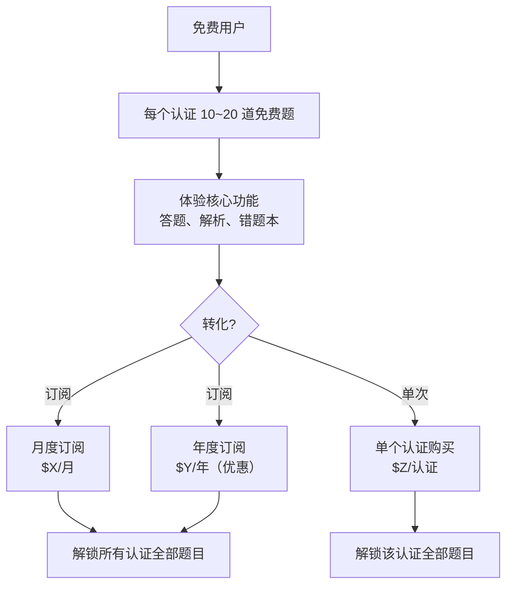
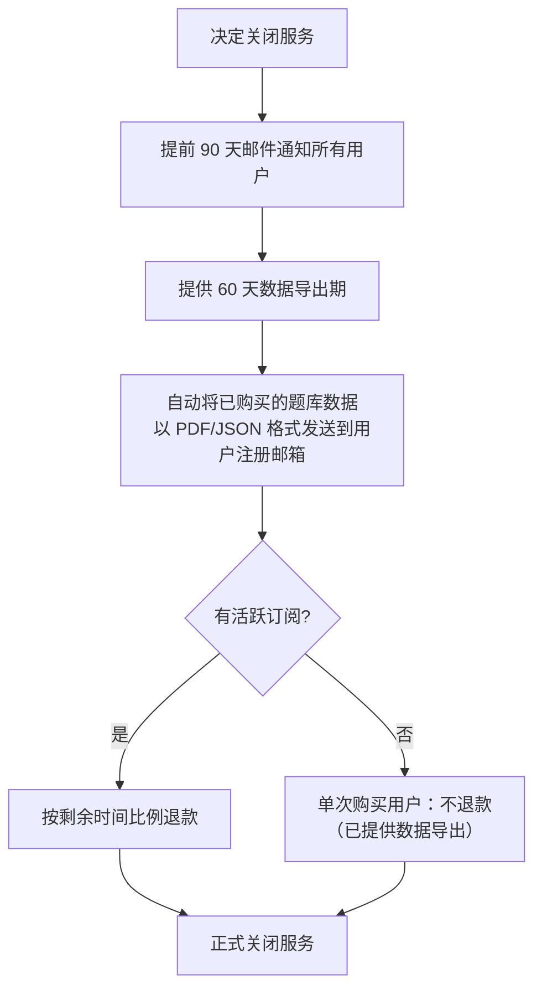
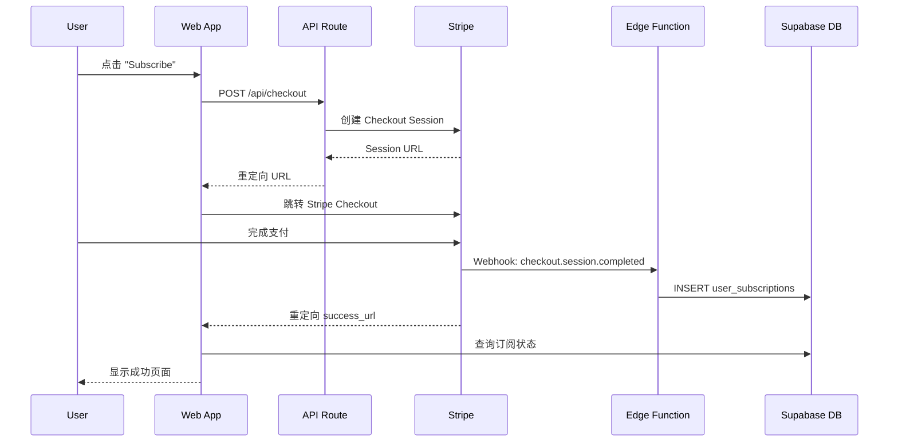

# 盈利模式详细设计

> 关联总纲：[Cursor.md](../Cursor.md) | 涉及页面：Landing Page Pricing、`/settings`、练习页面付费墙

## 概述

CloudCert 采用 Freemium 模式，每个认证题库提供 10~20 道免费题目供试用，超出部分需付费解锁。付费方式支持订阅制和单次购买两种路径，通过 Stripe 处理支付。

## 盈利策略

### 核心模型



### 方案对比

| | Free | 单次购买 | 月度订阅 (Pro) | 年度订阅 (Pro) |
|---|------|---------|---------------|---------------|
| 每个认证免费题目 | 10~20 | — | — | — |
| 单个认证全部题目 | ❌ | ✅（服务存续期内永久） | ✅ | ✅ |
| 所有认证全部题目 | ❌ | ❌ | ✅ | ✅ |
| 题目详解 | ✅ | ✅ | ✅ | ✅ |
| 错题本 | ✅ | ✅ | ✅ | ✅ |
| 进度追踪 | ✅ | ✅ | ✅ | ✅ |
| 搜索功能 | ✅ | ✅ | ✅ | ✅ |
| 服务终止时数据导出 | ❌ | ✅（邮件发送题库数据） | ✅ | ✅ |

### 定价策略（建议初始价格，后续根据市场调整）

| 方案 | 价格 | 说明 |
|------|------|------|
| Free | $0 | 每个认证 10~20 道题，全功能可用 |
| 单次购买 | $19.99/认证 | 服务存续期内永久访问该认证全部题目 |
| 月度订阅 | $9.99/月 | 访问所有认证全部题目 |
| 年度订阅 | $79.99/年 | 约 $6.67/月，节省 33% |

### 风险控制与服务条款

#### "永久"访问的定义

单次购买的"永久"指**服务存续期间**永久有效，而非无条件永久。服务条款须明确：

- "永久访问"指 CloudCert 平台正常运营期间，用户可无限期访问已购买认证的全部题目
- 平台保留因不可抗力、经营调整等原因终止服务的权利
- 不承诺题库内容永不变更（认证考试大纲更新时题库会同步调整）

#### 服务终止保障（Shutdown Guarantee）

如果 CloudCert 决定关闭服务，须对付费用户执行以下流程：



#### 数据导出内容

发送给付费用户的题库数据包含：

| 内容 | 格式 | 说明 |
|------|------|------|
| 题目 + 选项 + 解析 | PDF | 排版友好，可离线阅读和打印 |
| 题目 + 选项 + 解析 | JSON | 结构化数据，方便导入其他工具 |
| 用户练习记录 | CSV | 答题历史、正确率统计 |
| 错题汇总 | PDF | 所有错题及解析整理 |

#### 实现方式

- 数据导出通过 Supabase Edge Function 批量生成
- PDF 生成使用服务端 PDF 库（如 Puppeteer 或 jsPDF）
- 通过邮件服务（如 Resend / SendGrid）批量发送
- 用户也可在服务终止前从 Settings 页面手动触发导出

## 数据库设计

### 新增 `user_subscriptions` 表

| 字段 | 类型 | 约束 | 说明 |
|------|------|------|------|
| `id` | uuid | PK | 主键 |
| `user_id` | uuid | FK → users.id, NOT NULL | 用户 ID |
| `plan_type` | varchar | NOT NULL | 方案类型：`single_cert`（单次购买）、`monthly`（月订阅）、`yearly`（年订阅） |
| `certification_id` | uuid | FK → certifications.id, NULLABLE | 单次购买时关联的认证 ID，订阅制为 NULL（代表全部） |
| `status` | varchar | NOT NULL | 订阅状态：`active`、`cancelled`、`expired`、`past_due` |
| `stripe_customer_id` | varchar | | Stripe Customer ID |
| `stripe_subscription_id` | varchar | | Stripe Subscription ID（订阅制）|
| `stripe_payment_intent_id` | varchar | | Stripe Payment Intent ID（单次购买）|
| `current_period_start` | timestamp | | 当前计费周期开始时间 |
| `current_period_end` | timestamp | | 当前计费周期结束时间（单次购买为 NULL）|
| `created_at` | timestamp | NOT NULL, DEFAULT NOW() | 创建时间 |
| `updated_at` | timestamp | NOT NULL, DEFAULT NOW() | 更新时间 |

> 索引建议：`(user_id, status)` 用于快速查询用户有效订阅。

### RLS Policy

```sql
ALTER TABLE user_subscriptions ENABLE ROW LEVEL SECURITY;

CREATE POLICY "Users can view own subscriptions"
  ON user_subscriptions FOR SELECT
  USING (auth.uid() = user_id);
```

## 付费流程

### 订阅流程



### 单次购买流程

与订阅流程类似，但 Stripe 使用 `payment_intent` 而非 `subscription`：

1. 用户在认证详情页点击 "Buy This Certification"
2. 创建 Stripe Checkout Session（mode: `payment`）
3. 支付完成后 Webhook 写入 `user_subscriptions`（`plan_type = 'single_cert'`）

## 付费墙设计

### 练习页面付费提示

当免费用户试图访问超出免费范围的题目时：

```
┌─────────────────────────────────────────┐
│              🔒 Premium Content          │
│                                         │
│  You've completed all free questions    │
│  for AWS SAA.                           │
│                                         │
│  Unlock all 350 questions to continue   │
│  your preparation.                      │
│                                         │
│  ┌─────────────────────────────────┐    │
│  │ Buy AWS SAA          $19.99    │    │
│  │ Lifetime access to all questions│    │
│  └─────────────────────────────────┘    │
│                                         │
│  ─── OR ───                             │
│                                         │
│  ┌─────────────────────────────────┐    │
│  │ Subscribe to Pro     $9.99/mo  │    │
│  │ Access ALL certifications       │    │
│  └─────────────────────────────────┘    │
│                                         │
│  Save 33% with yearly plan ($79.99/yr)  │
│                                         │
└─────────────────────────────────────────┘
```

### 访问控制逻辑

```typescript
function canAccessQuestion(user, question, subscriptions) {
  if (question.is_free) return true;
  if (!user) return false;

  return subscriptions.some(sub =>
    sub.status === 'active' && (
      sub.plan_type === 'monthly' ||
      sub.plan_type === 'yearly' ||
      (sub.plan_type === 'single_cert' &&
       sub.certification_id === question.certification_id)
    )
  );
}
```

## Stripe 集成

### Webhook 事件处理

通过 Supabase Edge Function 接收 Stripe Webhook：

| 事件 | 处理 |
|------|------|
| `checkout.session.completed` | 创建 `user_subscriptions` 记录 |
| `invoice.payment_succeeded` | 更新 `current_period_end` |
| `invoice.payment_failed` | 更新 `status` 为 `past_due` |
| `customer.subscription.updated` | 同步订阅状态变更 |
| `customer.subscription.deleted` | 更新 `status` 为 `cancelled` |

### Stripe 产品配置

| Stripe Product | Price | Mode |
|---------------|-------|------|
| CloudCert Pro Monthly | $9.99/月 | Subscription (recurring) |
| CloudCert Pro Yearly | $79.99/年 | Subscription (recurring) |
| AWS SAA Question Bank | $19.99 | One-time payment |
| AWS SAP Question Bank | $19.99 | One-time payment |
| ... | ... | ... |

### Webhook 幂等性设计

Stripe 在投递失败时会**重试最多 30 次**，Edge Function 必须实现幂等性保护，防止重复操作。

#### 方案：`stripe_events` 事件记录表

```sql
CREATE TABLE stripe_events (
  event_id varchar PRIMARY KEY,
  event_type varchar NOT NULL,
  processed_at timestamp NOT NULL DEFAULT NOW()
);
```

Edge Function 处理流程：

```typescript
async function handleWebhook(event: Stripe.Event) {
  // 1. 幂等检查
  const { data: existing } = await supabase
    .from('stripe_events')
    .select('event_id')
    .eq('event_id', event.id)
    .single();

  if (existing) return new Response('Already processed', { status: 200 });

  // 2. 处理业务逻辑
  switch (event.type) {
    case 'checkout.session.completed':
      await handleCheckoutCompleted(event);
      break;
    // ...
  }

  // 3. 记录已处理事件
  await supabase.from('stripe_events').insert({
    event_id: event.id,
    event_type: event.type,
  });
}
```

同时为 `user_subscriptions` 添加唯一约束防止重复记录：

```sql
ALTER TABLE user_subscriptions
ADD CONSTRAINT unique_stripe_subscription
UNIQUE NULLS NOT DISTINCT (stripe_subscription_id);
```

## 未来扩展

| 功能 | 说明 | 阶段 |
|------|------|------|
| 优惠码 / 折扣 | 使用 Stripe 原生 Coupon / Promotion Code 能力，支持营销活动 | 第二阶段 |
| 多币种 | 通过 Stripe 自动货币转换或展示本地化价格（CNY、JPY 等） | 第二阶段 |
| 免费试用 | Pro 订阅提供 7 天免费试用（Stripe Trial Period） | 第二阶段 |

## 技术实现要点

- Stripe Checkout 使用 hosted 模式（跳转到 Stripe 页面），降低 PCI 合规成本
- Webhook 签名验证确保请求来自 Stripe
- 订阅状态通过 Webhook 实时同步，不依赖客户端上报
- 付费墙在前端（隐藏内容）和后端（RLS Policy）双重校验
- 用户可在 `/settings` 页面管理订阅（通过 Stripe Customer Portal）
