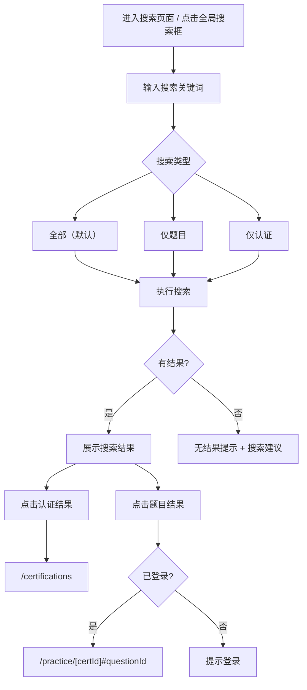

# 搜索功能详细设计

> 关联总纲：[Cursor.md](../Cursor.md) | 路由：`/search`

## 概述

搜索功能允许用户快速定位题目和认证内容。支持两种搜索对象：题目内容搜索和认证类型搜索。搜索页面无需登录即可访问，但题目详情需登录查看。

## 搜索类型

| 搜索对象 | 搜索范围 | 说明 |
|---------|---------|------|
| 题目 | `questions.question_text`、`question_translations.question_text` | 按题目内容关键词搜索 |
| 认证 | `certifications.name`、`certifications.code`、`certification_translations.name` | 按认证名称或编码搜索 |

## 用户流程



## 页面设计

### 全局搜索入口

- **位置**：Navigation Bar 中的搜索图标，点击展开搜索框
- **行为**：输入后按 Enter 跳转到 `/search?q=keyword`；也可直接在下拉中展示前 5 条预览结果
- **快捷键**：`Cmd/Ctrl + K` 打开搜索框

### 搜索页面 (`/search`)

```
┌─────────────────────────────────────────┐
│  ← Home        Search                   │
│─────────────────────────────────────────│
│                                         │
│  🔍 [____________________________] 🔎  │
│                                         │
│  Filters: [All] [Questions] [Certs]     │
│                                         │
│  Results for "EC2" (23 results)         │
│                                         │
│─────────── Certifications (2) ─────────│
│  📜 AWS Solutions Architect Associate   │
│     Provider: AWS | 350 questions       │
│  📜 AWS SysOps Administrator            │
│     Provider: AWS | 200 questions       │
│                                         │
│─────────── Questions (21) ─────────────│
│  📋 AWS SAA > Compute                   │
│  Q: Which service provides resizable    │
│  compute capacity... [EC2]              │
│  Difficulty: Medium | Type: Single      │
│                                         │
│  📋 AWS SAA > Compute                   │
│  Q: How do you encrypt an existing      │
│  unencrypted [EC2] EBS volume?          │
│  Difficulty: Hard | Type: Multiple      │
│                                         │
│  ...                                    │
│  Load More                              │
└─────────────────────────────────────────┘
```

### 页面元素

| 元素 | 说明 |
|------|------|
| 搜索输入框 | 支持实时搜索（debounce 300ms），URL 同步 query string |
| 筛选标签 | All / Questions / Certifications，切换搜索范围 |
| 结果分组 | 认证结果和题目结果分组展示，各组显示匹配数量 |
| 认证结果卡片 | 认证名称、厂商、题目数量，点击跳转认证列表 |
| 题目结果卡片 | 认证+分类标签、题目预览（关键词高亮）、难度、类型 |
| 空状态 | 无结果时显示提示和搜索建议 |
| 分页 | Load More 加载更多，每次 20 条 |

## 搜索实现策略

### PostgreSQL 全文搜索

使用 PostgreSQL 内置的 `tsvector` / `tsquery` 实现英文全文搜索，配合 `pg_trgm` 扩展支持中文搜索。

#### 英文搜索：添加搜索向量列

```sql
-- questions 表添加搜索向量（仅英文原文）
ALTER TABLE questions ADD COLUMN search_vector tsvector
  GENERATED ALWAYS AS (
    to_tsvector('english', coalesce(question_text, ''))
  ) STORED;

CREATE INDEX idx_questions_search ON questions USING GIN (search_vector);

-- certifications 表添加搜索向量
ALTER TABLE certifications ADD COLUMN search_vector tsvector
  GENERATED ALWAYS AS (
    to_tsvector('english', coalesce(name, '') || ' ' || coalesce(description, '') || ' ' || coalesce(code, ''))
  ) STORED;

CREATE INDEX idx_certifications_search ON certifications USING GIN (search_vector);
```

> **注意**：`GENERATED ALWAYS` 列仅包含英文原文，不覆盖翻译表内容。翻译内容的搜索通过下方的 `pg_trgm` 方案实现。

#### 中文搜索：pg_trgm 扩展

PostgreSQL 原生 `tsvector` **不支持中文分词**，`to_tsvector('english', ...)` 对中文文本会将整段作为一个 token，搜索效果极差。使用 `pg_trgm`（Trigram）扩展实现中文及多语言模糊搜索：

```sql
-- 启用 pg_trgm 扩展
CREATE EXTENSION IF NOT EXISTS pg_trgm;

-- 翻译表添加 Trigram 索引
CREATE INDEX idx_qt_question_text_trgm
  ON question_translations USING GIN (question_text gin_trgm_ops);

CREATE INDEX idx_ct_name_trgm
  ON certification_translations USING GIN (name gin_trgm_ops);
```

> **未来扩展**：当数据量增长到万级以上时，可考虑引入 MeiliSearch / Algolia 等专业搜索引擎替代数据库搜索。

#### 搜索查询

```sql
-- 搜索题目
SELECT q.id, q.question_text, q.question_type, q.difficulty,
       c.name AS cert_name, cat.name AS category_name,
       ts_rank(q.search_vector, plainto_tsquery('english', $1)) AS rank
FROM questions q
JOIN certifications c ON c.id = q.certification_id
JOIN categories cat ON cat.id = q.category_id
WHERE q.search_vector @@ plainto_tsquery('english', $1)
ORDER BY rank DESC
LIMIT 20 OFFSET $2;

-- 搜索认证
SELECT id, name, code, provider, description, total_questions
FROM certifications
WHERE search_vector @@ plainto_tsquery('english', $1)
  AND is_active = true
ORDER BY ts_rank(search_vector, plainto_tsquery('english', $1)) DESC;
```

### 多语言搜索

- 英文搜索：使用 `questions.search_vector`（tsvector 全文搜索，性能最佳）
- 其他语言搜索：使用 `pg_trgm` 索引查询 `question_translations` 表

```sql
-- 搜索翻译内容（如用户输入中文关键词）
-- 使用 pg_trgm 索引加速，比纯 ILIKE 快数十倍
SELECT qt.question_id
FROM question_translations qt
WHERE qt.language = $1
  AND qt.question_text % $2;  -- pg_trgm 相似度匹配

-- 或使用 ILIKE 做精确子串匹配（pg_trgm GIN 索引同样加速 ILIKE）
SELECT qt.question_id
FROM question_translations qt
WHERE qt.language = $1
  AND qt.question_text ILIKE '%' || $2 || '%';
```

### 关键词高亮

```sql
SELECT ts_headline('english', q.question_text,
  plainto_tsquery('english', $1),
  'StartSel=<mark>, StopSel=</mark>, MaxWords=50, MinWords=20'
) AS highlighted_text
FROM questions q
WHERE q.search_vector @@ plainto_tsquery('english', $1);
```

## URL 参数

| 参数 | 说明 | 示例 |
|------|------|------|
| `q` | 搜索关键词 | `/search?q=EC2` |
| `type` | 搜索类型 | `/search?q=EC2&type=questions` |
| `page` | 分页页码 | `/search?q=EC2&page=2` |

## 技术实现要点

- 搜索输入使用 `useDebounce` hook（300ms 延迟）减少请求
- URL search params 与搜索状态双向同步（浏览器前进/后退可用）
- 搜索结果使用 Server Component 渲染，SEO 友好
- 关键词高亮在服务端完成（`ts_headline`），前端使用 `dangerouslySetInnerHTML` 渲染
- 全局搜索框使用 Dialog/Modal 组件，支持 `Cmd/Ctrl + K` 快捷键

## 响应式设计

| 断点 | 布局调整 |
|------|---------|
| Desktop (≥1024px) | 搜索结果双列布局（认证+题目并列）或单列 |
| Tablet (768-1023px) | 单列布局 |
| Mobile (<768px) | 全宽搜索框，结果卡片全宽，筛选标签水平滚动 |
