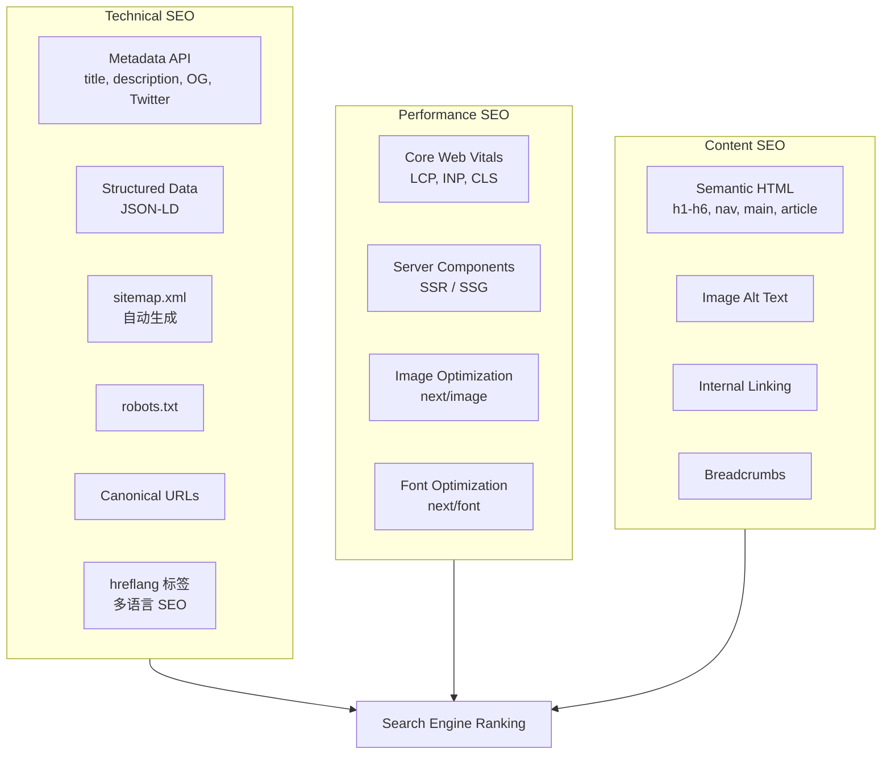

# SEO 策略详细设计

> 关联总纲：[Cursor.md](../Cursor.md) | 贯穿所有公开页面

## 概述

CloudCert 所有公开页面必须遵循 SEO 最佳实践，确保在 Google 等搜索引擎上获得最佳排名。利用 Next.js 16 的 Metadata API、Server Components 和静态生成能力，实现高性能、可抓取、结构化的页面。

## SEO 架构总览



## 各页面 Meta 配置

### Next.js Metadata API 使用

使用 Next.js 16 的 `generateMetadata` 函数为每个页面生成动态 Meta：

```typescript
// app/[locale]/layout.tsx - 全局默认 Meta
import type { Metadata } from 'next';

export const metadata: Metadata = {
  metadataBase: new URL('https://cloudcert.com'),
  title: {
    template: '%s | CloudCert',
    default: 'CloudCert - Pass Your Cloud Certification',
  },
  description: 'Practice cloud certification exams with comprehensive question banks, detailed explanations, and progress tracking.',
  openGraph: {
    type: 'website',
    siteName: 'CloudCert',
    locale: 'en_US',
  },
  twitter: {
    card: 'summary_large_image',
  },
  robots: {
    index: true,
    follow: true,
  },
};
```

### 各页面 Meta 详细配置

| 页面 | Title | Description | OG Image | 备注 |
|------|-------|-------------|----------|------|
| `/` Landing Page | "CloudCert - Pass Your Cloud Certification with Confidence" | "Practice AWS, Azure, GCP certification exams with..." | 品牌 OG 图 | 最重要的 SEO 页面 |
| `/certifications` | "Cloud Certification Question Banks \| CloudCert" | "Browse AWS, Azure, GCP certification question banks..." | 认证图标组合图 | 分类页，高搜索价值 |
| `/certifications/[code]` | "{certName} Practice Questions \| CloudCert" | "Practice {totalQuestions} questions for {certName}..." | 动态生成 | 动态 Meta，`generateMetadata` |
| `/search` | "Search Questions \| CloudCert" | "Search cloud certification questions and exams..." | — | 搜索页 |
| `/roadmap` | "Product Roadmap \| CloudCert" | "See what's coming next for CloudCert..." | — | |
| `/auth/login` | "Login \| CloudCert" | — | — | `noindex`（登录页不需要索引） |
| `/auth/register` | "Sign Up \| CloudCert" | — | — | `noindex` |
| `/dashboard` | "Dashboard \| CloudCert" | — | — | `noindex`（需登录） |
| `/practice/*` | — | — | — | `noindex`（需登录） |
| `/wrong-answers` | — | — | — | `noindex`（需登录） |
| `/settings` | — | — | — | `noindex`（需登录） |

### 动态页面 Meta 示例

```typescript
// app/[locale]/certifications/[code]/page.tsx
export async function generateMetadata({ params }): Promise<Metadata> {
  const cert = await getCertification(params.code);

  return {
    title: `${cert.name} Practice Questions`,
    description: `Practice ${cert.totalQuestions} questions for ${cert.name}. Detailed explanations, progress tracking, and multi-language support.`,
    openGraph: {
      title: `${cert.name} Practice Questions | CloudCert`,
      description: `Prepare for your ${cert.name} exam with ${cert.totalQuestions} practice questions.`,
      images: [{ url: cert.ogImageUrl || '/og/certifications.png' }],
    },
    alternates: {
      canonical: `https://cloudcert.com/certifications/${params.code}`,
      languages: {
        'en': `https://cloudcert.com/en/certifications/${params.code}`,
        'zh': `https://cloudcert.com/zh/certifications/${params.code}`,
      },
    },
  };
}
```

## Structured Data (JSON-LD)

为搜索引擎提供结构化数据，获得富摘要（Rich Snippets）。

### Landing Page — Organization + WebSite

```json
{
  "@context": "https://schema.org",
  "@type": "WebSite",
  "name": "CloudCert",
  "url": "https://cloudcert.com",
  "description": "Cloud certification exam practice platform",
  "potentialAction": {
    "@type": "SearchAction",
    "target": "https://cloudcert.com/search?q={search_term_string}",
    "query-input": "required name=search_term_string"
  }
}
```

### Landing Page — FAQ

```json
{
  "@context": "https://schema.org",
  "@type": "FAQPage",
  "mainEntity": [
    {
      "@type": "Question",
      "name": "What certifications does CloudCert support?",
      "acceptedAnswer": {
        "@type": "Answer",
        "text": "CloudCert currently supports AWS certifications..."
      }
    }
  ]
}
```

### Certifications Page — Course (每个认证)

```json
{
  "@context": "https://schema.org",
  "@type": "Course",
  "name": "AWS Solutions Architect Associate Practice",
  "description": "350 practice questions with detailed explanations",
  "provider": {
    "@type": "Organization",
    "name": "CloudCert"
  },
  "offers": {
    "@type": "Offer",
    "price": "19.99",
    "priceCurrency": "USD"
  }
}
```

### Pricing — Product

```json
{
  "@context": "https://schema.org",
  "@type": "Product",
  "name": "CloudCert Pro",
  "description": "Access all certification question banks",
  "offers": [
    {
      "@type": "Offer",
      "price": "9.99",
      "priceCurrency": "USD",
      "priceValidUntil": "2027-12-31",
      "availability": "https://schema.org/InStock"
    }
  ]
}
```

### 实现方式

```typescript
// components/JsonLd.tsx
export function JsonLd({ data }: { data: Record<string, unknown> }) {
  return (
    <script
      type="application/ld+json"
      dangerouslySetInnerHTML={{ __html: JSON.stringify(data) }}
    />
  );
}
```

## 多语言 SEO (hreflang)

### URL 结构

每个公开页面都有对应的多语言版本：

```
https://cloudcert.com/en/certifications     (English)
https://cloudcert.com/zh/certifications     (中文)
```

### hreflang 标签

由 next-intl 和 Next.js Metadata API 自动生成：

```html
<link rel="alternate" hreflang="en" href="https://cloudcert.com/en/certifications" />
<link rel="alternate" hreflang="zh" href="https://cloudcert.com/zh/certifications" />
<link rel="alternate" hreflang="x-default" href="https://cloudcert.com/en/certifications" />
```

### Metadata alternates 配置

```typescript
export async function generateMetadata({ params }): Promise<Metadata> {
  return {
    alternates: {
      canonical: `https://cloudcert.com/${params.locale}/certifications`,
      languages: {
        'en': 'https://cloudcert.com/en/certifications',
        'zh': 'https://cloudcert.com/zh/certifications',
      },
    },
  };
}
```

## Sitemap

### 自动生成

使用 Next.js 16 内置的 `sitemap.ts`：

```typescript
// app/sitemap.ts
import type { MetadataRoute } from 'next';

export default async function sitemap(): Promise<MetadataRoute.Sitemap> {
  const certs = await getAllActiveCertifications();
  const locales = ['en', 'zh'];

  const staticPages = ['', '/certifications', '/roadmap', '/search'];

  const entries: MetadataRoute.Sitemap = [];

  for (const locale of locales) {
    for (const page of staticPages) {
      entries.push({
        url: `https://cloudcert.com/${locale}${page}`,
        lastModified: new Date(),
        changeFrequency: page === '' ? 'weekly' : 'monthly',
        priority: page === '' ? 1.0 : 0.8,
        alternates: {
          languages: Object.fromEntries(
            locales.map(l => [l, `https://cloudcert.com/${l}${page}`])
          ),
        },
      });
    }

    for (const cert of certs) {
      entries.push({
        url: `https://cloudcert.com/${locale}/certifications/${cert.code}`,
        lastModified: cert.updatedAt,
        changeFrequency: 'weekly',
        priority: 0.9,
        alternates: {
          languages: Object.fromEntries(
            locales.map(l => [l, `https://cloudcert.com/${l}/certifications/${cert.code}`])
          ),
        },
      });
    }
  }

  return entries;
}
```

### Robots.txt

```typescript
// app/robots.ts
import type { MetadataRoute } from 'next';

export default function robots(): MetadataRoute.Robots {
  return {
    rules: [
      {
        userAgent: '*',
        allow: '/',
        disallow: ['/dashboard', '/practice/', '/wrong-answers', '/settings', '/auth/'],
      },
    ],
    sitemap: 'https://cloudcert.com/sitemap.xml',
  };
}
```

## Semantic HTML 规范

### Heading 层级规范

每个页面必须有且只有一个 `<h1>`，Heading 层级不跳级：

| 页面 | h1 | h2 示例 |
|------|-----|---------|
| Landing Page | "Pass Your Cloud Certification with Confidence" | "Features", "Pricing", "FAQ" |
| Certifications | "Cloud Certification Question Banks" | 各认证名称 |
| Certification Detail | "{certName} Practice Questions" | "Practice Mode", "By Category" |
| Search | "Search Questions & Certifications" | "Certifications (N)", "Questions (N)" |
| Roadmap | "Product Roadmap" | "Phase 1: Foundation", "Phase 2: ..." |

### 必须使用的语义化标签

| HTML 标签 | 使用场景 |
|-----------|---------|
| `<nav>` | 导航栏、面包屑 |
| `<main>` | 页面主要内容区域 |
| `<article>` | 独立内容块（如认证卡片、题目卡片） |
| `<section>` | Landing Page 各功能区块 |
| `<aside>` | 答题卡片侧边栏 |
| `<header>` | 页面头部 |
| `<footer>` | 页面底部 |
| `<figure>` + `<figcaption>` | 图表、统计图 |

### Breadcrumbs

公开页面提供面包屑导航（有 JSON-LD 结构化数据支持）：

```
Home > Certifications > AWS SAA
Home > Search > "EC2"
Home > Roadmap
```

```json
{
  "@context": "https://schema.org",
  "@type": "BreadcrumbList",
  "itemListElement": [
    { "@type": "ListItem", "position": 1, "name": "Home", "item": "https://cloudcert.com" },
    { "@type": "ListItem", "position": 2, "name": "Certifications", "item": "https://cloudcert.com/certifications" },
    { "@type": "ListItem", "position": 3, "name": "AWS SAA" }
  ]
}
```

## Performance SEO (Core Web Vitals)

Google 将 Core Web Vitals 作为排名因素，必须达标：

| 指标 | 目标 | 实现方式 |
|------|------|---------|
| LCP (Largest Contentful Paint) | < 2.5s | Server Components SSR、`next/image` 优化、字体预加载 |
| INP (Interaction to Next Paint) | < 200ms | 减少客户端 JS 体积、避免主线程阻塞、`useTransition` |
| CLS (Cumulative Layout Shift) | < 0.1 | 图片/广告预留尺寸、字体 `font-display: swap`、避免动态注入 |

### Next.js 性能优化措施

- **Server Components 优先**：公开页面尽量使用 Server Components，减少客户端 JS
- **next/image**：所有图片使用 `<Image>` 组件，自动 WebP/AVIF 转换、lazy loading、响应式 srcset
- **next/font**：使用 `next/font/google` 加载字体，自动 `font-display: swap` + 自托管
- **Dynamic Import**：非首屏组件使用 `next/dynamic` 懒加载（如 FAQ Accordion、图表）
- **Static Generation**：Landing Page、Roadmap、Certifications 列表使用 ISR（Incremental Static Regeneration）
- **Streaming SSR**：使用 `<Suspense>` 实现流式渲染，加速 TTFB

### 渲染策略

| 页面 | 渲染方式 | 说明 |
|------|---------|------|
| `/` Landing Page | ISR (revalidate: 3600) | 内容较稳定，每小时重新生成 |
| `/certifications` | ISR (revalidate: 3600) | 认证列表缓存 1 小时 |
| `/certifications/[code]` | ISR (revalidate: 1800) | 认证详情缓存 30 分钟 |
| `/search` | SSR (dynamic) | 搜索结果需实时计算 |
| `/roadmap` | SSG (static) | 静态页面，代码更新时重新生成 |
| `/dashboard` | SSR (dynamic, noindex) | 用户个人数据，不索引 |
| `/practice/*` | SSR (dynamic, noindex) | 答题页，不索引 |

## Image SEO

- 所有 `<Image>` 组件必须提供有意义的 `alt` 属性
- 认证图标：`alt="AWS Solutions Architect Associate certification icon"`
- Hero 插图：`alt="Cloud certification exam preparation illustration"`
- 使用描述性文件名：`aws-saa-certification.webp` 而非 `img001.webp`

## Internal Linking 策略

- Landing Page 链接到 Certifications、Pricing（锚点）、FAQ（锚点）、Roadmap
- Certifications 列表链接到各认证详情页
- 认证详情页链接回 Certifications 列表（面包屑）
- Footer 包含所有重要页面链接
- 博客/内容营销页面（未来）链接到对应认证练习页

## 监控与分析

| 工具 | 用途 |
|------|------|
| Google Search Console | 索引状态、搜索表现、Core Web Vitals 监控 |
| Google Analytics 4 | 流量分析、用户行为 |
| Vercel Analytics | 实时性能监控（LCP、INP、CLS） |
| Vercel Speed Insights | 真实用户性能数据 |

## 技术实现检查清单

- [ ] 每个公开页面都有唯一的 `title` 和 `description`
- [ ] 每个公开页面都有 Open Graph 和 Twitter Card meta
- [ ] 所有公开页面生成 hreflang 标签
- [ ] `sitemap.xml` 包含所有公开页面和多语言版本
- [ ] `robots.txt` 正确屏蔽需登录的页面
- [ ] Landing Page 有 FAQPage + WebSite JSON-LD
- [ ] 认证页面有 Course JSON-LD
- [ ] 所有页面使用正确的 Heading 层级（单一 h1）
- [ ] 所有图片有描述性 `alt` 属性
- [ ] 公开页面有面包屑导航（HTML + JSON-LD）
- [ ] Core Web Vitals 达标（LCP < 2.5s, INP < 200ms, CLS < 0.1）
- [ ] 公开页面优先使用 Server Components + ISR/SSG
- [ ] `next/image` 和 `next/font` 正确使用
- [ ] Google Search Console 和 Analytics 已配置
