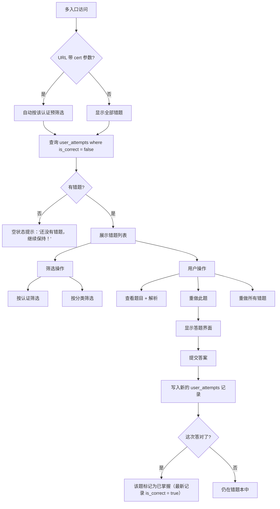

# 错题本功能详细设计

> 关联总纲：[Cursor.md](../Cursor.md) | 路由：`/wrong-answers`

## 概述

错题本自动收集用户在练习中答错的题目，支持按认证和分类筛选、重做练习、查看解析。数据来源于 `user_attempts` 表中 `is_correct = false` 的记录。

## 入口

错题本有多个访问入口，均跳转到 `/wrong-answers` 页面（可带筛选参数）：

| 入口位置 | 说明 | 跳转 URL |
|---------|------|---------|
| 侧栏导航 / Dashboard | 全局入口，查看所有错题 | `/wrong-answers` |
| 认证详情页（练习入口） | 该认证的错题数量卡片，点击 "Review" | `/wrong-answers?cert=aws-saa` |
| 练习总结页 | 完成练习后 "Review Wrong Answers" 按钮 | `/wrong-answers?cert=aws-saa` |
| 答题卡片（Answer Card） | 可查看错题数量汇总 | `/wrong-answers?cert=aws-saa` |

> 从认证详情页进入时，自动按该认证预筛选，用户可在页面内调整筛选条件。

## 用户流程



## 页面设计

### 错题本主页 (`/wrong-answers`)

```
┌─────────────────────────────────────────┐
│  ← Dashboard       Wrong Answers        │
│─────────────────────────────────────────│
│                                         │
│  Total: 23 wrong answers                │
│                                         │
│  Filters:                               │
│  [All Certs ▼] [All Categories ▼]       │
│                                         │
│  [ Redo All Wrong Answers ]             │
│                                         │
│─────────────────────────────────────────│
│  📋 AWS SAA > Compute                   │
│  Q: Which service provides resizable... │
│  Your answer: A. Amazon S3              │
│  Correct: B. Amazon EC2                 │
│  Attempted: 2 times | Last: 2026-03-14  │
│  [ View Detail ] [ Redo ]               │
│─────────────────────────────────────────│
│  📋 AWS SAA > Storage                   │
│  Q: What is the maximum size of an...   │
│  Your answer: C. 1 TB                   │
│  Correct: D. 5 TB                       │
│  Attempted: 1 time | Last: 2026-03-13   │
│  [ View Detail ] [ Redo ]               │
│─────────────────────────────────────────│
│  ...                                    │
│  Load More                              │
└─────────────────────────────────────────┘
```

### 页面元素

| 元素 | 说明 |
|------|------|
| 统计概览 | 当前错题总数 |
| 筛选栏 | 按认证、按分类下拉筛选 |
| 重做全部按钮 | 进入重做模式，按顺序重做所有错题 |
| 错题卡片 | 认证+分类标签、题目预览、用户答案 vs 正确答案、尝试次数、最后答题时间 |
| 操作按钮 | "View Detail" 展开解析 / "Redo" 重新答题 |
| 分页 | 使用 "Load More" 加载更多，每次加载 20 条 |

### 错题详情（展开视图）

点击 "View Detail" 后在卡片内展开：

- 完整题目文本
- 所有选项（标记用户选择和正确答案）
- 详细解析（参见 [design-explanation.md](design-explanation.md)）
- 语言切换按钮

### 重做模式

点击 "Redo" 或 "Redo All" 后进入答题界面：

- 界面与练习模式的答题界面一致
- 区别：顶部标题显示 "Redo Wrong Answers"
- 重做结果写入新的 `user_attempts` 记录
- 完成后显示重做总结页（与练习总结页类似）

## 数据查询

### 获取错题列表

```sql
-- 获取用户的错题（最新一次答题为错的题目）
SELECT DISTINCT ON (ua.question_id)
  ua.question_id,
  ua.selected_option_ids,
  ua.is_correct,
  ua.attempted_at,
  q.question_text,
  q.certification_id,
  q.category_id,
  c.name AS certification_name,
  cat.name AS category_name,
  COUNT(*) OVER (PARTITION BY ua.question_id) AS attempt_count
FROM user_attempts ua
JOIN questions q ON q.id = ua.question_id
JOIN certifications c ON c.id = q.certification_id
JOIN categories cat ON cat.id = q.category_id
WHERE ua.user_id = $1
ORDER BY ua.question_id, ua.attempted_at DESC;

-- 外层再筛选 is_correct = false（最新一次答错的）
```

### 错题统计

```sql
-- 各认证的错题数量
SELECT c.name, COUNT(*) AS wrong_count
FROM (
  SELECT DISTINCT ON (question_id) question_id, is_correct
  FROM user_attempts
  WHERE user_id = $1
  ORDER BY question_id, attempted_at DESC
) latest
JOIN questions q ON q.id = latest.question_id
JOIN certifications c ON c.id = q.certification_id
WHERE latest.is_correct = false
GROUP BY c.name;
```

## 错题判定逻辑

- 一道题的"错题"状态由该题的**最新一次**答题记录决定
- 如果用户重做后答对了，该题从错题列表中移除（最新记录 `is_correct = true`）
- 如果用户重做后仍然答错，该题保留在错题本中
- 不删除历史记录，所有答题记录永久保留在 `user_attempts` 中

## 技术实现要点

- 使用 Server Component 加载初始错题列表
- 筛选和分页使用 URL Search Params（`?cert=aws-saa&category=compute&page=2`）
- 错题详情展开/折叠使用 Framer Motion 12 动画
- 重做模式复用练习模式的答题组件
- 使用 `react-markdown` 渲染解析内容

## 响应式设计

| 断点 | 布局调整 |
|------|---------|
| Desktop (≥1024px) | 错题卡片列表，最大宽度 900px |
| Tablet (768-1023px) | 同 Desktop |
| Mobile (<768px) | 卡片全宽，筛选栏改为水平滚动标签 |
